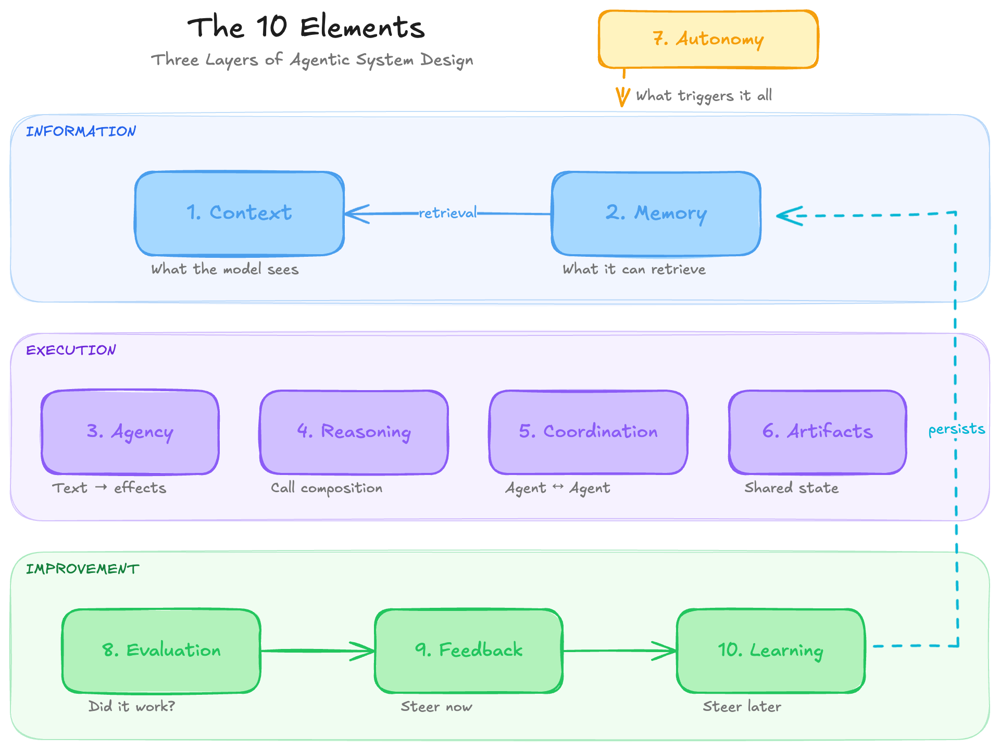
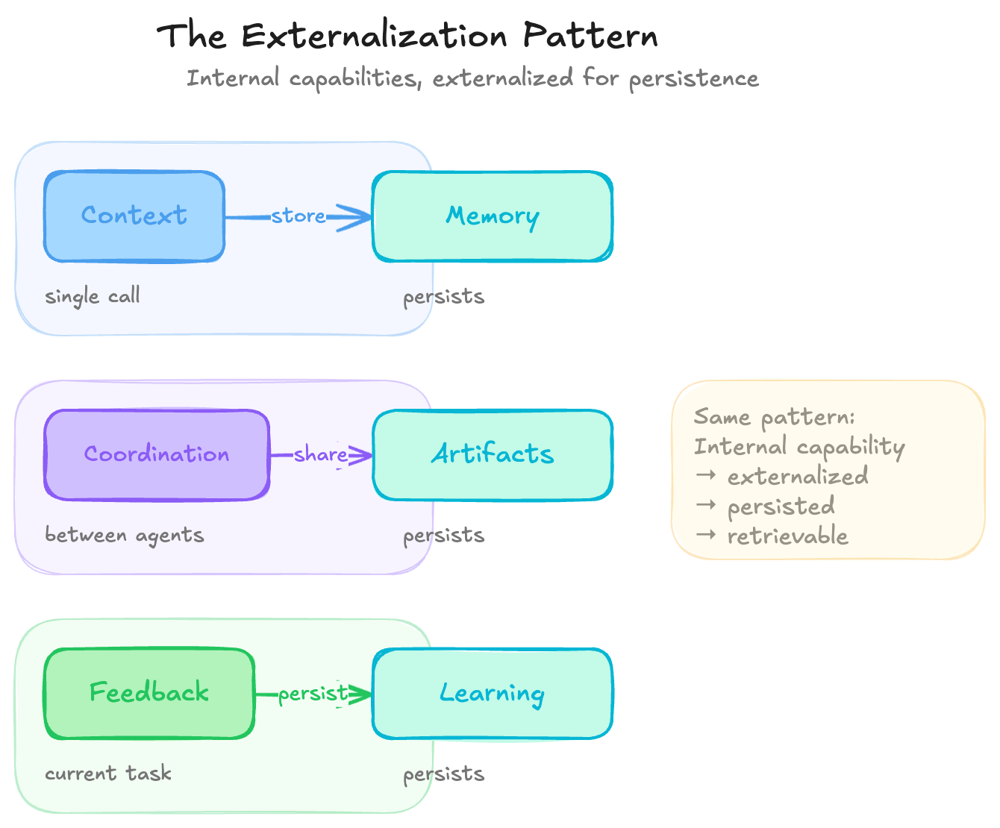
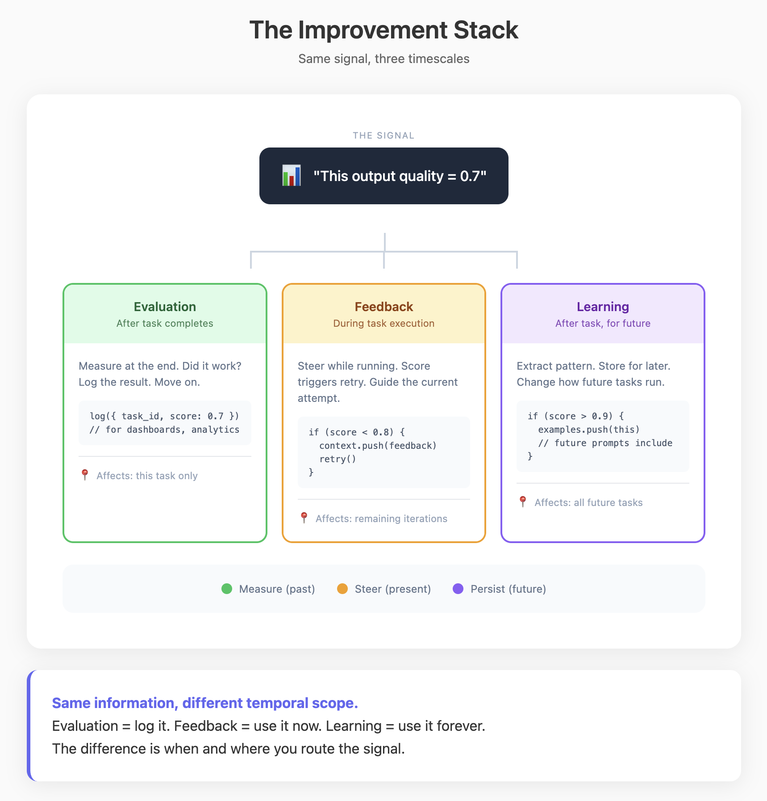

# Elements of Agentic System Design

*A Conceptual Framework for the Design of Intelligent Systems from First Principles*

[](https://creativecommons.org/licenses/by/4.0/)

**[Read the complete framework](complete-elements.md)** | **[Raw text (LLM-friendly)](https://raw.githubusercontent.com/idyllic-labs/elements-of-agentic-system-design/main/complete-elements.md)**

**Who this is for:** This is a design space map for people building agent frameworks, languages, SDKs, and platforms. It shows what users expect from agents, the code patterns that implement those expectations, and where agentic system designs vary.

Also useful for practitioners building agents on these systems, and for readers who want to understand how agentic systems map to concrete software components. Some familiarity with LLMs and software systems is assumed.

This repository contains the outline for **a forthcoming book**. **Interested in co-authoring?** Reach out to **william@idylliclabs.com**.



## Contents

- [The 10 Elements](#the-10-elements)
- [What This Framework Provides](#what-this-framework-provides)
- [Motivation](#motivation)
- [Key Relationships](#key-relationships)
- [Quick Reference: Behavior → Implementation](#quick-reference-behavior--implementation)
- [Claude Code Skill](#claude-code-skill)
- [Related Work & Influences](#related-work--influences)
- [Contributing](#contributing)
- [License](#license)

## The 10 Elements

| # | Element | What it is | Where capability lives |
|---|---------|------------|------------------------|
| 1 | [**Context**](elements/1-context.md) | Information available to the model for a single call | Token budget + context construction |
| 2 | [**Memory**](elements/2-memory.md) | External storage for selective retrieval into context | Storage structures + retrieval mechanisms |
| 3 | [**Agency**](elements/3-agency.md) | Translation layer from text to effects | Execution boundary + policy enforcement |
| 4 | [**Reasoning**](elements/4-reasoning.md) | Grammar of call composition (chaining, looping, branching) | Call structure + interstitial computation |
| 5 | [**Coordination**](elements/5-coordination.md) | Communication and sequencing between reasoning structures | Execution flow + data flow |
| 6 | [**Artifacts**](elements/6-artifacts.md) | Shared persistent state for coordination | Typed objects + operations + lifecycle |
| 7 | [**Autonomy**](elements/7-autonomy.md) | What triggers execution, who owns the main loop | Trigger infrastructure + context reconstruction |
| 8 | [**Evaluation**](elements/8-evaluation.md) | Determining whether the system succeeded | Quality signals + measurement functions |
| 9 | [**Feedback**](elements/9-feedback.md) | Gradient signals that steer behavior | Signal sources + injection points |
| 10 | [**Learning**](elements/10-learning.md) | Feedback that persists to change future behavior | Learnable parameters + extraction pipeline |


## What This Framework Provides

The 10 elements are indexed on **intuitive notions of intelligence**, not implementation categories. Each element is named for the behavior its code patterns produce.

### A Conceptual Map
Defined terms for each element (context, memory, agency, etc.) and the mechanisms that implement them.

### An Analysis Tool
A way to **take apart any agentic system**. Given an agent, you can break it down into these 10 elements and understand how it works mechanistically.

### A Debugging Framework
When something isn't working, the elements help you **isolate the problem**:
- Agent forgetting things? → Context or Memory problem
- Agent not doing what you want? → Agency or Reasoning problem
- Agents stepping on each other? → Coordination or Artifacts problem
- Agent not improving? → Evaluation, Feedback, or Learning problem

### Behavior-to-Code Mapping
For each observed behavior, the framework names the corresponding code pattern.

## Motivation

This framework came from building agent frameworks and platforms, and from the frustration of working in a space that moves fast but lacks conceptual grounding. The excitement around the technology leads people to conflate model capability with system intelligence. As models improve, the bottleneck shifts to system design, but there's no shared vocabulary for where things should go.

When you want to implement something smart in an agentic system, you need to know where it belongs: is it a context problem, a memory problem, a coordination problem? Without a clean conceptual framework, every design decision feels ad hoc. You end up reinventing patterns or mislocating functionality because there's no map of the design space.

This framework provides that map. The model is a stateless text-to-text function. Everything else (memory, agency, reasoning, coordination, learning) is architecture you build around it. Every intelligent-seeming behavior traces to concrete code: loops, database queries, schedulers, policy checks. Once you see this, agentic systems become software you design, inspect, and debug like any other program.


## Key Relationships



A recurring **externalization pattern** appears throughout the framework:
- **Memory** = externalized context (storage for a single agent)
- **Artifacts** = externalized coordination (shared state for multiple agents)
- **Learning** = externalized feedback (patterns stored for future behavior)

**The improvement stack:**
- **Evaluation** measures quality
- **Feedback** steers the current task
- **Learning** persists feedback to steer future tasks



## Quick Reference: Behavior → Implementation

Each behavior in the left column corresponds to a concrete implementation pattern in the right column.

| "It seems to..." | Actually is... |
|------------------|----------------|
| Remember what I said | Conversation history array in prompt |
| Have long-term memory | Database + retrieval into context |
| Do things in the world | Structured output → parser → function dispatch |
| Think step by step | Multiple calls with state passed between |
| Plan before acting | `plan = llm(task)` → `for step in plan: execute(step)` |
| Check its own work | Generate → separate verify call → conditional retry |
| Have multiple experts | Different system prompts routed by classifier |
| Work while I sleep | Cron job triggers agent |
| Learn from experience | Outcomes → extraction → stored → retrieved into future contexts |

## Claude Code Skill

This repository includes a [Claude Code](https://claude.ai/claude-code) skill that lets you analyze and design agentic systems using this framework.

### Installation

**Personal (all your projects):**
```bash
mkdir -p ~/.claude/skills/intelligence-designer
curl -o ~/.claude/skills/intelligence-designer/SKILL.md \
  https://raw.githubusercontent.com/idyllic-labs/elements-of-agentic-system-design/main/SKILL.md
```

**Project-specific:**
```bash
mkdir -p .claude/skills/intelligence-designer
curl -o .claude/skills/intelligence-designer/SKILL.md \
  https://raw.githubusercontent.com/idyllic-labs/elements-of-agentic-system-design/main/SKILL.md
```

### Usage

Once installed, use the skill in Claude Code:

```
/intelligence-designer Analyze how Claude Code handles context management

/intelligence-designer How does a typical RAG chatbot work?

/intelligence-designer Design an agent that monitors GitHub issues and auto-triages them
```

The skill injects the full framework into context and guides Claude to think mechanistically about agentic systems, tracing behaviors to code patterns, identifying elements, and spotting tradeoffs.

## Related Work & Influences

This framework builds on and is influenced by the following resources:

### Foundational Reading

- **[Intelligence Design](https://www.wcdc.io/writing/intelligence-design)** — Argues that intelligent behavior in AI systems is designed, not emergent. Understanding agentic systems means understanding the architecture that produces intelligent-seeming behavior.

### Analyses

- **[OpenClaw vs Claude Code](https://www.wcdc.io/writing/openclaw-vs-cc)** — An analysis of two agentic coding systems using this framework.

### Prior Art

- **[Building Effective Agents](https://www.anthropic.com/research/building-effective-agents)** (Anthropic, 2024) — Anthropic's guide to building agents with simple, composable patterns. Emphasizes starting simple and only adding complexity when needed. Introduces workflow patterns: prompt chaining, routing, parallelization, orchestrator-workers, evaluator-optimizer.

- **[12-Factor Agents](https://github.com/humanlayer/12-factor-agents)** (HumanLayer) — Principles for building production-ready LLM applications, inspired by Heroku's 12-Factor App methodology. Key insights: own your prompts, manage context windows explicitly, own your control flow, small focused agents beat monoliths.

- **[Agentic Design Patterns](https://www.deeplearning.ai/the-batch/how-agents-can-improve-llm-performance/)** (Andrew Ng, 2024) — Four key patterns: Reflection, Tool Use, Planning, and Multi-Agent Collaboration. Helped popularize the term "agentic" in the AI community.

- **[Agentic Design Patterns: A System-Theoretic Framework](https://arxiv.org/abs/2601.19752)** (arXiv, 2025) — Academic framework decomposing agentic systems into five functional subsystems: Reasoning & World Model, Perception & Grounding, Action Execution, Learning & Adaptation, and Inter-Agent Communication.

### How This Framework Differs

The above resources focus on **how to build** agents (patterns, best practices, implementation). This framework focuses on **analyzing** agents: decomposing their behavior into elements and mapping each to specific code patterns.

## Contributing

Contributions are welcome! This is an open project and we appreciate help from the community.

### Ways to Contribute

- **Report issues** — Found an error or unclear explanation? Open an issue.
- **Suggest improvements** — Have ideas for better examples or clearer framing? Let us know.
- **Add examples** — Real-world case studies that illustrate the elements are valuable.
- **Translate** — Help make this framework accessible in other languages.

### Co-Authorship

This outline will be expanded into a book. If you're interested in co-authoring or making substantial contributions, please contact **william@idylliclabs.com** with:
- Your background and expertise
- Which elements you're interested in contributing to
- Any relevant writing samples or prior work

See [CONTRIBUTING.md](CONTRIBUTING.md) for detailed guidelines.

## License

This work is licensed under [Creative Commons Attribution 4.0 International (CC BY 4.0)](https://creativecommons.org/licenses/by/4.0/).

You are free to:
- **Share** — copy and redistribute the material in any medium or format
- **Adapt** — remix, transform, and build upon the material for any purpose, including commercially

Under the following terms:
- **Attribution** — You must give appropriate credit, provide a link to the license, and indicate if changes were made.

## Attribution

**Elements of Agentic System Design**

A project by [Idyllic Labs](https://idyllic.so).

Created by [William Chen](https://twitter.com/stablechen), based on over two years of experience building agentic systems.

AI tools assisted in the editing and structuring of this work, primarily Claude Opus 4.5 (Anthropic) and GPT-5.2 (OpenAI).

## Contact

- **Email**: william@idylliclabs.com
- **Twitter**: [@stablechen](https://twitter.com/stablechen)

---

# Element Reference

---

## Element 1: CONTEXT

---

### Introduction

**What it is:** The information available to the model for a single call. The model can only use what's present in the context window for that call.

**Why it's foundational:** When you talk to an AI assistant, it feels like there's a continuous mind on the other side—one that remembers what you said, adjusts to your preferences, and builds on prior work. But the model itself is a stateless function. It has no memory between calls, no ongoing experience, no persistent identity.

The "agent" you experience is not inside the model. It emerges from how you construct the context for each call. The personality, the memory, the knowledge—all of it is reconstructed from storage and injected into the prompt every single time. Context is where this construction happens.

**What it looks like:** For each call, you assemble a temporary world from four sources:
1. **System instructions** — how the model should behave
2. **Retrieved information** — facts and data relevant to the task
3. **Conversation history** — prior turns in the current interaction
4. **Current input** — what the user is asking right now

Whatever appears in this assembled context is the model's entire universe for that reasoning step. It cannot see past its edges. It cannot remember beyond its duration.

---

### Demystification

#### Intelligent Behaviors → Code Patterns

| Behavior (looks like) | Implementation (actually is) |
|----------------------|------------------------------|
| "Remembers what I said" | Conversation history array injected into prompt |
| "Knows about me" | User profile object serialized into context |
| "Stays in character" | System prompt prepended to every call |
| "Follows my instructions" | Custom instructions appended to system prompt |
| "Understands the document" | Document text (or chunks) included in context |
| "Maintains conversation flow" | Message array with role tags (user/assistant) |

#### The Core Mechanism

**The model is a stateless text-to-text function.** It takes text in and returns text out. Between calls, the model does not retain state, run computations, or store memory of previous calls. It is inert.

**Continuity is reconstruction, not persistence.** On every turn, your system assembles a fresh context from stored artifacts and sends it to the model. The model role-plays having whatever history you included. The AI you experience is precisely the context you construct.


**Most "model failures" are reconstruction failures.** When the agent "forgets" something, the information was missing from context. When it hallucinates, the context lacked grounding facts. When behavior is inconsistent, the assembled context was different. The model did exactly what it always does—reason over the text you provided. The text was wrong.

#### System Prompt Precedence

Models are trained to treat system messages with higher priority than user messages—similar to how an operating system treats kernel-mode instructions differently from user-mode. This prioritization is probabilistic, not absolute, but it makes system instructions more resistant to being overridden by later user input.

#### Self-Consistency Can Be Exploited

Models produce outputs consistent with the entire context. If you inject fake assistant messages showing the model "already" doing something forbidden, it may continue in that vein—it's trying to be consistent with the (fictional) history you provided. This is the mechanism behind many prompt injection attacks.

#### Models Tolerate Imperfect Context

Context does not need to be perfectly formatted prose. Models handle incomplete sentences, raw JSON, log fragments, bullet points, and text a human would struggle to parse. As long as enough signal is present, the model reconstructs meaning from noisy, partial, or fragmented input. This is why RAG works with arbitrarily chunked documents—the chunks don't need to be coherent standalone passages. You don't need perfect curation; you need sufficient signal.

---

### Design Considerations

#### The Economics of Attention

**Bigger windows aren't automatically better.** Attention is roughly O(n²) in sequence length—double the tokens, quadruple the computation. This shows up as latency.

**Quality vs quantity tradeoff.** Every irrelevant token competes with relevant ones for attention. A carefully curated 2,000-token context often yields better results than a noisy 16,000-token one. Signal-to-noise ratio matters more than raw size.

**"Lost in the middle."** Empirically, tokens in the middle of very long sequences receive less effective attention than tokens at the beginning or end. Critical information should go at the start or end of context, not buried in the middle.

#### Working Beyond Context Limits

When tasks exceed any single context window:

**Chunking + Retrieval (RAG):** Split large corpora into chunks, embed them, retrieve only chunks relevant to the current question. The model never sees everything—just a curated slice.

**Compression + Summarization:** Summarize documents into compact representations. Use summaries for high-level reasoning, drill into full text only when needed.

**Task Decomposition:** Break complex questions into subquestions, answer each with its own focused context, then synthesize. Each call has a tailored view of the problem.

#### Key Tradeoffs

| Tradeoff | Tension |
|----------|---------|
| Completeness vs. noise | More context = more information but also more dilution |
| Recency vs. relevance | Recent history may not be most relevant |
| Raw documents vs. summaries | Summaries save tokens but lose detail |
| Full history vs. compressed | Compression is lossy |
| Cost vs. quality | Longer context = more tokens = higher cost and latency |

#### Key Questions

**1. What's included and why?**
Identify what information the model needs to see for this task, and the selection mechanism that determines relevance.

For a code agent: which files, which error messages, how much history? For a research assistant: which documents, how many chunks? The selection mechanism might be semantic similarity, recency, explicit user references, dependency analysis, or some combination.

Look for: What's the minimum viable context? What's the relevance function? How does the system decide what matters *right now* vs. what's noise?

**2. How is context constructed?**
Identify whether context is accumulated, retrieved, or reconstructed.

- **Accumulated**: Grows as interaction proceeds. Chat history appends each turn. Simple but eventually overflows.
- **Retrieved**: Pulled from storage based on current query. RAG systems work this way. Relevant but may miss conversational continuity.
- **Reconstructed**: Rebuilt from scratch each turn using stored state. Most flexible but requires explicit decisions about what to include.

Most systems are hybrids. A code agent might reconstruct task context each turn while accumulating conversation history.

**3. How is the finite window managed?**
Identify what happens when relevant information exceeds capacity.

- **Truncation**: Drop oldest or lowest-priority content. Simple but loses information.
- **Summarization**: Compress older content. Preserves more but lossy and adds latency.
- **Decomposition**: Split into multiple calls with different contexts. Powerful but complex orchestration.
- **Selection**: Only include top-k most relevant. Requires good relevance scoring.

The tradeoff is completeness vs. noise. More context means more information but also more dilution of attention.

**4. How is attention managed?**
Identify how the system handles attention economics—the fact that not all tokens are weighted equally.

Models weight beginning and end of context more heavily than the middle ("lost in the middle"). Quality degrades as context length increases. Every irrelevant token competes with relevant ones.

Look for: Where are critical instructions positioned? Are constraints repeated? Is there explicit prioritization of signal over noise? Does the system use a larger window just because it can, or does it curate aggressively?

**5. What's grounded vs. assumed?**
Identify what the model is expected to know from its weights vs. what must be explicitly provided.

Models have parametric knowledge—general facts, coding patterns, language understanding—baked into their weights. But they don't know your codebase, your company's policies, today's date, or what happened earlier in the conversation.

For factual tasks, parametric knowledge is often unreliable (hallucination risk). The question is: what does this system trust the model to know, and what does it explicitly ground with provided context?

#### Patterns

- **Context builders with explicit token budgets** — allocate fixed budgets per source, truncate to fit
- **Chunking strategies** — split documents at semantic boundaries, overlap for continuity
- **Priority queues for retrieval** — rank retrieved items, include only top-k
- **Sliding windows over history** — keep recent N turns, summarize older ones
- **Position-aware placement** — critical instructions at start, grounding facts at end

---

### The Reframe

**Before:** "Why does the AI keep forgetting things?"
**After:** "I need to reconstruct the relevant history into context on each call."

**Before:** "The model is hallucinating."
**After:** "I didn't provide grounding facts, so the model filled gaps from parametric knowledge."

**Before:** "The AI's personality is inconsistent."
**After:** "The system prompt or context structure changed between calls."

---

## Element 2: MEMORY

---

### Introduction

**What it is:** External storage designed for selective retrieval into context. Memory is the infrastructure that supplies data to the context window.

**Why it's foundational:** When you use a capable AI system over time, it appears to accumulate information about you. Your preferences are preserved, prior jokes reappear, and projects resume without restating the full history. The system seems to build a private representation that includes history, facts, and an ongoing relationship.

That representation does not live in the model. Between calls, the model is empty. Yet your system clearly knows more on day 30 than it did on day 1. That additional information is stored outside the model.

You are balancing a fixed-size context window against an unbounded amount of stored information. The model's working world is finite; the rest lives in external storage and is selectively retrieved back into context.

The core design problem is not how to store everything, but how to decide what to retrieve into context. The illusion of a coherent, remembering agent arises from that decision, repeated over time.

**What it looks like:** Memory uses three primary storage structures:
1. **Arrays (episodic)** — ordered sequences of events, conversation history, logs
2. **Maps (structured)** — key-value pairs, user profiles, entity attributes
3. **Vectors (semantic)** — embeddings that enable similarity search

Each structure enables different retrieval patterns. Arrays give recency and position. Maps give direct lookup by key. Vectors give semantic similarity. The storage structure determines what questions you can ask later.


---

### Demystification

#### Intelligent Behaviors → Code Patterns

| Behavior (looks like) | Implementation (actually is) |
|----------------------|------------------------------|
| "Has long-term memory" | Database/file storage + retrieval into context |
| "Recalls relevant info" | Vector similarity search over embedded chunks |
| "Remembers past conversations" | Conversation log table + query by recency/relevance |
| "Learns my preferences" | Entity extraction → key-value store → inject on retrieval |
| "Knows project context" | Document chunks + embedding index + top-k retrieval |
| "Forgets old stuff appropriately" | TTL/expiration on records, summarization jobs |
| "Has a proper understanding or world-view" | Explanatory text string in context + model interprets at read time |

#### The Core Mechanism

**Memory is external storage.** The model has no persistent state. What we call "memory" is data persisted in your system—databases, files, vector stores—that you selectively load into context.

**No matter what memory system you build—databases, vector stores, knowledge graphs, file systems—it only affects model behavior by becoming text in the context window.** This is the fundamental constraint. Memory does not flow into the model through any other channel. The model sees text; memory systems produce text. Everything else is plumbing to decide which text.

You store data in whatever format is convenient—JSON, prose, triplets. When building context, you serialize it to text. The model reads that text and interprets its meaning. The understanding happens at read time, inside the model, not in your storage.

**Models tolerate imperfect, fragmented input.** Retrieved chunks do not need to be perfectly formatted prose. They can be incomplete sentences, raw JSON, log fragments, or bullet points a human would struggle to parse. As long as enough signal is present, the model reconstructs meaning from noisy, partial data. This is why RAG works with arbitrarily chunked documents, why you can include some irrelevant context without catastrophic failure, and why you don't need to obsess over perfect curation. The model is robust to messy retrieval—it fills gaps and makes sense of fragments.

**You can reconstruct useful context text from compact storage representations.** Storage format does not need to match context format. You can store structured JSON and serialize it; the model handles JSON fine. You can store triplets and convert them to sentences. The representation that's efficient for storage need not be the one optimal for the model—you transform at retrieval time.

#### How Vector Stores Work

Vector stores convert text into numerical representations called embeddings. An embedding model transforms a sentence into a high-dimensional vector—a point in space. Sentences with similar meanings end up near each other.

When you search, the vector store converts your query into an embedding and finds stored items whose embeddings are geometrically closest. "Similar meaning" becomes "nearby in vector space."

This behaves like a graph where related items are connected, but the connections are computed on demand from vector distances rather than stored explicitly. In an explicit graph, you store edges between related items and maintain them as facts change (N items can have N² connections). With vectors, you store each item as a point, and relationships emerge at query time by computing distances.

The tradeoff: similarity is approximate. The embedding model's training determines what "similar" means. Domain jargon, rare terminology, or novel concepts may not embed well if the model never saw them during training.

---

### Design Considerations

#### Key Tradeoffs

| Tradeoff | Tension |
|----------|---------|
| Storage vs. retrieval | Storage is inexpensive; retrieval quality determines system behavior |
| Recency vs. relevance | Recent events are vivid but may not be most relevant |
| Semantic vs. structural | Semantic search is flexible but imprecise; key lookup is exact but requires knowing the key |
| Completeness vs. noise | More retrieved = more information but also more dilution |
| Remembering vs. forgetting | Without forgetting, systems accumulate cruft and contradictions |

#### Key Questions

**1. What's stored and how is it structured?**

Identify what information is persisted and in what format.

- **Episodic (arrays):** Ordered sequences like conversation history, event logs. Enables recency queries and positional access.
- **Structured (maps):** Key-value pairs like user profiles, preferences, entity attributes. Enables direct lookup by identifier.
- **Semantic (vectors):** Embedded text chunks. Enables similarity search across content.

Most systems use all three: episodic for "what just happened," structured for "what do we know about this entity," semantic for "what's relevant to this question." Look for: What's the primary structure? What retrieval patterns does it enable? What queries become impossible because they weren't indexed for?

**2. How is retrieval executed?**

Identify the mechanisms that pull information from storage into context.

- **Recency-based:** Take the last N items. Simple, fast, but misses important old information.
- **Key-based:** Look up by identifier (user ID, entity name). Exact but requires knowing what to ask for.
- **Semantic:** Find items similar to the current query. Flexible but approximate.
- **Hybrid:** Combine multiple signals with scoring.

Look for: What triggers retrieval? What mechanisms are available? How are candidates selected when there are more matches than context budget?

**3. How is multi-dimensional relevance balanced?**

Identify how the system weighs recency, semantic similarity, and importance.

Relevance is not one-dimensional. Recent events are vivid. Semantically similar content is topically relevant. Some facts are important regardless of age or topic match.

If the system overweights recency, it responds well to the immediate conversation but may ignore long-term commitments. If it overweights importance, the same items appear frequently regardless of relevance. If it overweights semantic similarity, it stays on-topic but may omit simple facts that lack semantic hooks in the query.


Look for: What weights are applied? Do they vary by question type or conversation stage? What personality does the retrieval policy create?

**4. What gets forgotten and how?**

Identify the forgetting strategy: what's pruned, what's preserved, what triggers cleanup.

- **Summarization:** Compress old content into summaries. Preserves themes, loses literal details.
- **Expiration:** Delete items older than a threshold. Simple but risky for durable facts.
- **Curation:** Mark important items as protected, aggressively prune the rest.

Without forgetting, old information degrades retrieval quality—outdated preferences, superseded facts, trivial acknowledgments. Regular cleanup of stored data keeps retrieval biased toward current and important information.

Look for: What expires? What gets summarized? What's protected? When is cleanup triggered?

**5. Where does retrieval fail?**

Identify the blindspots in the retrieval strategy.

Semantic similarity fails on:
- **Negation:** "I do NOT want spicy food" retrieves spicy food documents (embeddings encode topics, not logic)
- **Indirect references:** "The thing we discussed yesterday" has no semantic hooks
- **Domain jargon:** Specialized terms may not embed well if absent from training data
- **Homonyms:** "Jaguar" blends animal, car, and OS senses

Structural gaps: You can only retrieve what you indexed for. If you only stored by position, you cannot query by meaning. If you only embedded content, you cannot query by recency efficiently.

Look for: What queries does the current structure fail on? What complementary retrieval paths are needed?

#### Patterns

- **Hybrid storage:** Episodic + structured + semantic over the same underlying data
- **Multi-signal retrieval:** Combine recency, semantic similarity, and importance scores
- **Token budgeting:** Allocate fixed budgets per source, rank and truncate
- **Memory extraction:** LLM processes conversation turns into structured facts for the map
- **Compression triggers:** After N interactions, summarize older content into one
- **Importance markers:** Flag items that should survive aggressive pruning
- **Position-aware scoring:** Bias toward recent within ties

---

### The Reframe

**Before:** "How do I give it long-term memory?"
**After:** "How do I store things so I can retrieve the right pieces into context at the right time?"

**Before:** "Why did it forget that important thing I said?"
**After:** "That information wasn't retrieved into this context—either it wasn't stored, wasn't indexed for this query type, or scored too low."

**Before:** "The agent has a short attention span."
**After:** "The retrieval policy overweights recency. Important old information needs higher importance scores or a different retrieval path."

---

## Element 3: AGENCY

---

### Introduction

**What it is:** The translation layer from text to effects. The "interpreter" in code that takes output from the model and executes operations.

**Why it's foundational:** Text alone never causes effects. The model outputs text; your code decides whether to execute it. The email gets sent at the line that calls the SMTP API—remove that line and nothing happens, no matter what the model outputs.

The agent is not inside the model. It is the composite: model proposing, code executing, results feeding back.

**What it looks like:**
```
Model output (text) → Parser/Router → Policy check → Execution → Effects
```


---

### Demystification

#### Intelligent Behaviors → Code Patterns

| Behavior (looks like) | Implementation (actually is) |
|----------------------|------------------------------|
| "Can do things" | Structured output → parser → function dispatch |
| "Browses the web" | `browser_tool` handler + HTML parser |
| "Writes and runs code" | `code_execution` tool + sandboxed interpreter |
| "Sends emails/messages" | API integration wrapped as tool |
| "Makes decisions" | Classification output → switch/router |
| "Uses multiple tools together" | Code generation or defined tool chains |
| "Knows what it can do" | Tool schemas injected into system prompt |

#### The Core Mechanism

**The model has no agency.** Agency is causality—the ability to cause effects in the world. The model produces text (data); your code interprets that text and executes it. Text by itself is inert data; interpreting and running it turns data into effects.

**The most dangerous mistake in agent design is implicit execution.** If arbitrary action-like text can trigger real effects without explicit parsing and policy checks, you have removed the boundary between model output and system execution.

#### Tool Calling Is Structured Output with Routing

When you enable "tool calling" or "function calling," the model's output changes shape—from prose to structured JSON naming tools and passing arguments. Mechanistically, nothing about the model has changed. It still only emits text. The difference is that you treat some of that text as structured JSON that your code parses and routes to specific functions.

Tool calling standardizes three things:
1. **Format** — The model produces JSON with a known shape, not arbitrary prose to regex
2. **Vocabulary** — A closed set of tool names, each with clear description and schema
3. **Router** — One place where model intent translates into function calls

The tradeoffs: constrained tools give predictable surface area (model can't invent tools), validatable input (schema checks before execution), and simple security (no `deleteAllUsers` tool means no deletion). The cost is flexibility—behavior not expressible as a sequence of tool calls requires adding new tools or multiple round-trips.


#### Code Execution Is the Same Pattern

When a model writes code instead of selecting from tools, it appears qualitatively different. Mechanistically, nothing fundamental has changed. The model outputs text that happens to be code; your sandbox decides whether to run it, under what constraints, and with what capabilities exposed.

If code is never executed, it causes no effects. If it runs in a sandbox without network or filesystem access, it has less capability than a tool that can send email. Your infrastructure confers or withholds agency—the model just writes strings.

Within a constrained sandbox, a single call can express loops, conditionals, and data transformations without tool round-trips. But bugs become runtime errors, security mistakes in sandbox configuration can expose unintended capability, and observability is harder than with clean tool logs.

#### Agency Is a System Property

The agent is the entire loop: model deciding, code executing, results feeding back. Remove any piece and you get something different:

- **No model:** A fixed script that always calls the same tool. Causal but not adaptive.
- **No execution:** A chatbot that promises but never does. Conversational but not agentic.
- **No feedback:** A system that acts but never learns from results. Powerful but brittle.

When something goes wrong, you can ask three separate questions:
1. Did the **model** choose a bad action given its instructions and context?
2. Did the **execution layer** authorize something it should have blocked?
3. Did **you** define tools or policies that made the bad outcome possible?

This decomposition is how you debug and improve agent systems.

---

### Design Considerations

#### Key Tradeoffs

| Tradeoff | Tension |
|----------|---------|
| Tools vs. code | Tools constrain (safer, predictable); code expands (flexible, riskier) |
| Flexibility vs. safety | More capability = more potential for damage |
| Automation vs. oversight | Auto-execution is fast but risky; approvals are safe but slow |
| Expressiveness vs. observability | Code is expressive but hard to log; tools are limited but auditable |

#### Key Questions

**1. What actions are possible?**

Identify the action space—the set of operations the system can perform.

- **Finite tool set:** Named functions with schemas. Model can't invent new tools.
- **Code execution:** Arbitrary computation within sandbox constraints.
- **Hybrid:** Tools for side effects, code for pure computation.

The action space is defined by your tool registry and sandbox configuration. If there's no `deleteAllUsers` tool and the sandbox has no database access, deletion is impossible no matter what the model outputs.

Look for: What's in the tool registry? What does the sandbox expose? What's explicitly impossible?

**2. How is intent translated to effect?**

Identify the execution boundary—where text becomes action.

- **Parsing:** How is model output interpreted? JSON schema validation? Code compilation?
- **Routing:** How are parsed instructions dispatched to handlers?
- **Execution:** Where does the actual API call, database write, or file operation happen?

The execution boundary should be explicit and singular. One place where model intent becomes function calls. This is where you inject policy checks, logging, and approvals.

Look for: Where exactly does text become effect? Is that boundary explicit or scattered?

**3. How are effects classified?**

Identify the effect categories and how scrutiny maps to stakes.

- **Read:** Fetches data, no state change. Usually auto-approved.
- **Write:** Modifies internal state. Logged, may require soft confirmation.
- **External:** Affects systems outside your control. Requires careful review.
- **Irreversible:** Cannot be undone (emails sent, payments made). Requires explicit approval or is blocked.

Look for: How are tools categorized? Does policy enforcement match the category? Are irreversible actions gated appropriately?

**4. Where is policy enforced?**

Identify the control points—where decisions about whether to execute are made.

- **Schema validation:** Reject malformed requests before execution
- **Policy checks:** Role-based access, rate limiting, environment restrictions
- **Approval gates:** Human confirmation for high-stakes actions
- **Simulation mode:** Execute against mock systems in staging

Policy should be centralized—one enforcement function between model intent and execution, not scattered checks across handlers.

Look for: Is there a single policy enforcement point? What gates exist for high-stakes actions? How does staging differ from production?

**5. What's logged at the boundary?**

Identify the observability surface—what records exist for debugging and audit.

Once systems cause effects, mistakes persist. Emails can't be unsent. Files can't be undeleted. You need records: what the model proposed, what policy decided, what actually happened.

A minimal action log captures: user request, proposed action (tool + arguments), authorization decision, execution status, and effects produced.

Look for: Is there a structured action log? Can you reconstruct what happened from logs? Can you identify whether failures were model decisions, policy failures, or tool bugs?

#### Patterns

- **Tool registries with effect metadata:** Each tool declares read/write/external/irreversible
- **Centralized policy enforcement:** One function between intent and execution
- **Schema validation before dispatch:** Reject malformed requests early
- **Approval workflows for irreversible actions:** Human gates for high stakes
- **Sandboxed code execution:** Constrained runtime for model-generated code
- **Structured action logs:** What was proposed, authorized, executed, effected
- **Different agent shapes against same tools:** Single-action, background, interactive differ in orchestration

---

### The Reframe

**Before:** "How do I make the AI do things?"
**After:** "How do I design the execution boundary between text and effects?"

**Before:** "The AI sent the wrong email."
**After:** "The model proposed an action, and my execution layer ran it. Which component failed—model decision, policy check, or tool definition?"

**Before:** "The agent has too much power."
**After:** "The tool registry and sandbox configuration define what's possible. I control the capability set."

---

## Element 4: REASONING

---

### Introduction

**What it is:** The grammar of call composition. How you chain, loop, branch, and merge LLM calls to build behavior that exceeds what any single call can do.

**Why it's foundational:** A single LLM call is bounded. It cannot pause mid-generation to fetch new data. It cannot execute code and observe results. It cannot genuinely reconsider after committing to tokens. Everything it produces is conditioned only on what was present at call start.

Reasoning appears when you compose multiple calls with computation between them. The behavior you observe in capable agents does not happen inside any single call—it emerges from the structure of calls, the artifacts passed between them, and the code that decides what happens next.

**What it looks like:** Multiple calls connected by your code:
```
Call → Result → [computation] → Call → Result → [computation] → ...
```

The computation between calls is where you inject information, verify outputs, branch into alternatives, and decide whether to continue or stop.

The **agent** is the canonical structure that emerges: a loop where the model decides the next action, your code executes it, and the result feeds back into context for the next iteration. The agent is not a special kind of model—it is a reasoning structure built from composition.

---

### Demystification

#### Intelligent Behaviors → Code Patterns

| Behavior (looks like) | Implementation (actually is) |
|----------------------|------------------------------|
| "Thinks step by step" | Multiple LLM calls with state passed between |
| "Plans before acting" | `plan = llm.call(...)` then `for step in plan: execute(step)` |
| "Checks its own work" | Generate call → separate verify call → conditional retry |
| "Recovers from errors" | Try/catch around execution → error fed back to next LLM call |
| "Keeps working until done" | While loop with termination condition check |
| "Breaks down complex tasks" | Recursive decomposition: task → subtasks → sub-subtasks |

#### The Core Mechanism

**Reasoning is the structure of how calls relate.** A single call generates text. Reasoning emerges from composing multiple calls with computation between them.

**A single call is bounded.** It produces one text output conditioned on what was known at call start. It cannot fetch new data mid-generation. It cannot execute tools and observe results. It cannot store to memory or retrieve from it. A single call has no agency and no memory—just text in, text out.

**Between calls, you can do work the model cannot.** This is what composition unlocks:

- **Inject information:** Fetch data, run tools, call APIs. The next call sees results that didn't exist before.
- **Verify:** Check outputs before proceeding—run tests, validate schemas, check constraints.
- **Focus:** Tailor context per call. A planning call sees only the task. An execution call sees only its step.
- **Branch:** Fork into parallel paths, explore alternatives.
- **Merge:** Combine outputs from multiple calls into one.
- **Loop:** Repeat until a condition is met.


These six operations are the primitives. The structures that emerge—pipelines, trees, DAGs, agent loops—are compositions of these primitives with code controlling the flow.

---

### Design Considerations

#### The Grammar of Composition

**Sequence** — Output of one call feeds the next:
```
Call A → Result A → Call B (using Result A) → Result B
```

**Branch** — Fork into parallel paths:
```
Call A → Result A
           ├→ Call B1 (path 1)
           └→ Call B2 (path 2)
```

**Merge** — Combine outputs from multiple calls:
```
Result B1 ─┐
           ├→ Call C (combining both)
Result B2 ─┘
```

**Loop** — Repeat until condition met:
```
while not done:
    result = call(context)
    context.append(result)
    done = check_termination(result)
```

#### The Agent Loop

The canonical form that combines all of the above:

```python
context = [task]
while True:
    action = model.decide_next_step(context)
    if action.type == "done":
        return action.result
    result = execute(action)
    context.append(action)
    context.append(result)
```

The model decides what to do next. Your code executes it. The result feeds back into context. The loop continues until the model signals completion or a limit is reached.

**Continuity across calls comes from your code.** The model does not remember previous calls—it reads its own history as text that your code accumulated. The apparent train of thought is real, but it lives in your orchestration, not inside the model.

#### Key Questions

**1. What's the composition structure?**

Identify the shape of how calls relate.

- **Pipeline:** Fixed sequence (plan → execute → verify). Code controls flow.
- **Tree:** Branch into alternatives, select best. Explores the output distribution.
- **Loop:** Repeat until done. The agent pattern.

Most agents are loops. Pipelines are for known processes. Trees are for exploration.

**2. What happens between calls?**

Identify the interstitial computation.

- **Tool execution:** Run the action the model requested
- **Information injection:** Fetch data, call APIs, observe results
- **Context update:** Append results, summarize history, prepare next input
- **Routing:** Decide which call to make next

**3. Who decides the next action—model or code?**

Identify where control flow lives.

- **Model-directed:** The model chooses what to do next from available tools. Flexible but unpredictable.
- **Code-directed:** Your code determines the sequence; model provides intelligence at each step. Predictable but rigid.
- **Hybrid:** Code controls phases; model has autonomy within each phase.

If you're fighting the prompt to enforce a specific process, the process probably belongs in code.

**4. How is history accumulated?**

Identify what the model sees of its own past.

Each iteration, the model reads the accumulated history as text. It has no memory—it sees what your code provides. You control what persists, what gets summarized, what gets dropped.

Accumulated context degrades quality over time. Strategies: sliding windows, periodic summarization, selective inclusion.

**5. What are the termination conditions?**

Identify how the loop knows when to stop.

- **Explicit signal:** Model outputs "done" or equivalent
- **Max iterations:** Hard limit prevents infinite loops
- **External condition:** Task completed, user interrupted, timeout

Infinite loops are a real failure mode. Define explicit exit conditions.

#### Key Tradeoffs

| Tradeoff | Tension |
|----------|---------|
| Single call vs. multiple | More calls = more capability but more latency and cost |
| Model-directed vs. code-directed | Model flexibility vs. predictable structure |
| Accumulated vs. reconstructed context | Continuity vs. relevance decay |

#### Patterns

- **Plan → Execute → Verify pipelines**
- **Separate generator and evaluator calls**
- **Iterative refinement loops** (generate → critique → revise)
- **Recursive decomposition** (task → subtasks → sub-subtasks)
- **Checkpointing** for long-running sequences

---

### The Reframe

**Before:** "How do I make it think step by step?"
**After:** "I externalize the steps into separate calls with computation between them."

**Before:** "The agent seems to have a continuous train of thought."
**After:** "My code accumulates history and injects it into each call. The model reads its own past as text."

**Before:** "Why can't it just figure out what it needs and go get it?"
**After:** "A single call can't fetch new information mid-generation. I need to split into multiple calls with retrieval between them."

---

## Element 5: COORDINATION

---

### Introduction

**What it is:** Communication and sequencing between reasoning structures. Two questions: **what runs when** (execution flow) and **what information passes** (data flow).

**Why it's foundational:** Once you have multiple reasoning structures—pipelines, loops, agents—you need to define how they connect. Execution flow determines sequencing—what triggers what, what runs in parallel. Data flow determines communication—what context transfers, what state is shared.

**What it looks like:** Reasoning structures connected by execution flow and data flow:
```
         ┌─────────────────────────────────────┐
         │           EXECUTION FLOW            │
         │  (what triggers what, sequencing)   │
         └─────────────────────────────────────┘
                          │
Input → Router → Agent A → Agent B → Output
                          │
         ┌─────────────────────────────────────┐
         │             DATA FLOW               │
         │  (what information transfers)       │
         └─────────────────────────────────────┘
```

Execution flow: Router decides Agent A runs first, then Agent B. Data flow: A's output is compressed into a handoff structure that B receives.


---

### Demystification

#### Intelligent Behaviors → Code Patterns

| Behavior (looks like) | Implementation (actually is) |
|----------------------|------------------------------|
| "Has multiple experts" | Different system prompts routed by classifier |
| "Knows who to ask" | Intent classification → dispatch to handler |
| "Delegates to specialist" | Handoff function that transfers context subset |
| "Team of agents working together" | Parallel calls + result aggregation |
| "Agents debate/discuss" | Turn-taking loop between different prompts |
| "Asks human for help" | Async wait + human input channel + resume |
| "Pipeline of specialists" | Sequential calls with typed handoffs |

#### The Core Mechanism

**Coordination has two dimensions: execution flow and data flow.**

- **Execution flow:** What triggers what. Who decides the next step. What runs in parallel vs. sequential. This is the control structure.
- **Data flow:** How information passes between reasoning structures. What context transfers on handoff. What shared state exists. This is the information structure.

**Execution flow patterns:**
- **Sequential:** Agent A finishes, then Agent B starts
- **Parallel:** Multiple agents run simultaneously, results merged
- **Conditional:** Router decides which agent runs
- **Nested:** One agent spawns sub-agents for subtasks

**Data flow patterns:**
- **Handoff:** A's output becomes B's input (compressed, structured)
- **Shared artifact:** Multiple structures read/write common state
- **Message passing:** Structures exchange discrete messages
- **Blackboard:** Central store that any structure can update

**Multi-agent = multi-context.** Each "agent" is reconstructed on every call from its system prompt and current context. What looks like agents conversing is: call with prompt A → append output → call with prompt B → append output. The value is specialization, not independent entities.

#### Why Split Into Multiple Reasoning Structures?

**Context economy.** Each structure gets a focused context: specialized prompt, curated tool set, smaller slice of history. One mega-context with everything leads to interference. Splitting buys you focus.

**Parallelization.** Like the actor model in distributed systems, independent structures can work simultaneously on different subtasks. Research five competitors in parallel, then synthesize. Total latency is the longest single task, not the sum.

---

### Design Considerations

#### Coordination Patterns

**Routing** — Classify and dispatch:
```
Input → Classifier → Dispatch to appropriate agent
```

**Pipeline** — Sequential processing with typed handoffs:
```
Agent A → Handoff → Agent B → Handoff → Agent C
```

**Parallel + Merge** — Fork, work concurrently, combine:
```
        ┌→ Agent B1 ─┐
Input ──┼→ Agent B2 ─┼→ Merge → Output
        └→ Agent B3 ─┘
```

**Shared Artifact** — Structures read/write common state:
```
Agent A ─┐           ┌─ Agent A
Agent B ─┼→ Artifact ←┼─ Agent B
Agent C ─┘           └─ Agent C
```

**Human-in-the-loop** — Human as async participant:
```
Agent → Request → [Human reviews] → Response → Agent continues
```

#### Key Questions

**1. What are the distinct reasoning structures?**

Identify the agents, pipelines, and loops that make up the system.

Each reasoning structure from Element 4 (pipelines, trees, loops, agent loops) becomes a unit that can be coordinated. An "agent" is a loop where the model decides actions; a "pipeline" is a fixed sequence. Each has its own context configuration—system prompt, tool set, history accumulation strategy.

Look for: What are the distinct units? What context configuration does each have? What makes each one specialized?

**2. What is the execution topology?**

Identify how reasoning structures sequence and trigger each other.

- **Pipeline:** Fixed sequence, Agent A → Agent B → Agent C
- **Parallel fork-join:** Multiple structures run concurrently, results merged
- **Conditional routing:** Classifier dispatches to one of several structures
- **Nested:** One agent spawns sub-agents for subtasks
- **Hybrid:** Combination of patterns

Look for: What triggers what? What runs concurrently vs. sequentially? Who decides the next step—code or model?

**3. How does routing work?**

Identify how work gets directed to the right reasoning structure.

- **LLM-based:** Model classifies input into categories
- **Rule-based:** Keywords, patterns, or explicit user choice
- **Hybrid:** Rules for clear cases, LLM for ambiguous ones

Look for: What's the classifier? How are routing errors detected? What happens on misrouting?

**4. What is the data flow?**

Identify what information passes between reasoning structures.

**Handoffs** (sequential transfer):
- **Full context:** Everything the previous structure accumulated. Complete but noisy.
- **Structured summary:** Compressed into typed object. High signal but lossy.
- **Selected fields:** Specific data the next structure needs. Minimal but brittle.

**Shared state** (concurrent access):
- **Shared artifact:** Document or data structure multiple structures read/write
- **Blackboard:** Central store any structure can update

Look for: What does each reasoning structure receive? What do multiple structures access concurrently?

**5. How do parallel paths merge?**

Identify how concurrent reasoning structures synchronize.

- **Barrier:** Wait for all parallel structures to complete, then merge results
- **First wins:** Take the first acceptable result, cancel others
- **Streaming:** Process results as they arrive

Look for: What triggers the merge? How are conflicts or inconsistencies resolved? What happens if one path fails?

**6. Where do humans participate?**

Identify where human judgment enters the coordination flow.

- **Approval gates:** Human must approve before high-stakes actions execute
- **Escalation:** Structure hands off to human when confidence is low
- **Review loops:** Human reviews output before it's passed to next structure
- **Async input:** System pauses, waits for human response, then resumes

Look for: What decisions require human approval? How is async human input handled? What's the fallback if human doesn't respond?

**7. What determines the boundaries between reasoning structures?**

Identify why the system is split into multiple structures rather than one.

Look for evidence of what drove the decomposition:
- **Context specialization:** Different structures need different prompts or tools
- **Parallelization opportunity:** Independent subtasks that can run concurrently
- **Phase separation:** Stages that need isolated context (planning vs. execution)
- **Failure isolation:** Containing blast radius of errors

If two structures have nearly identical configurations, the split may add unnecessary coordination overhead.

#### Key Tradeoffs

| Tradeoff | Tension |
|----------|---------|
| Specialization vs. coordination cost | Focused contexts vs. handoff complexity |
| Parallel vs. sequential | Speed vs. simplicity |
| Full context vs. compressed handoff | Completeness vs. noise |
| LLM routing vs. rule-based | Flexibility vs. reliability |

#### Patterns

- **Router classifiers** (LLM or rule-based)
- **Typed handoff structures** with explicit fields
- **Shared artifacts** that multiple structures read/write
- **Approval queues** for human-in-the-loop
- **Supervisor agents** that monitor and redirect

---

### The Reframe

**Before:** "How do I make agents talk to each other?"
**After:** "How do I move the right information between focused contexts?"

**Before:** "I need a team of AI agents."
**After:** "I need multiple specialized prompts with routing and handoffs."

**Before:** "The agents are collaborating."
**After:** "Different system prompts are being applied to a shared context in sequence."

---

## Element 6: ARTIFACTS

---

### Introduction

**What it is:** The persistent objects that work produces and that future work operates on. Artifacts are **shared persistent state for coordination** — where Element 2 (Memory) is storage for a single agent's context, artifacts are shared storage that multiple reasoning structures read and write.

**Why it's foundational:** Individual agent calls are short-lived, and message history is discarded when the next prompt is built. But task boards, draft documents, and code repositories persist across sessions and accumulate changes. Work produces artifacts, and artifacts become the coordination surface for future work.

Without artifacts, multi-agent systems try to carry all state in messages and context windows, but the work product has no persistent location. With artifacts, progress is stored in objects that outlive any single agent call.

**What it looks like:** Shared objects with structure, operations, and lifecycle:
```
Agent A ─┐                    ┌─ Agent A
Agent B ─┼→ Artifact (state) ←┼─ Agent B
Agent C ─┘    ↓               └─ Agent C
         Operations: addSection(), claimTask(), approve()
         Lifecycle: draft → review → approved → published
```

Agents don't message each other directly — they read the artifact's current state, perform operations, and write updates. The artifact is the coordination surface.

---

### Demystification

#### Intelligent Behaviors → Code Patterns

| Behavior (looks like) | Implementation (actually is) |
|----------------------|------------------------------|
| "Maintains a document collaboratively" | Shared object with `addSection()`, `editSection()` operations |
| "Tracks progress on tasks" | State machine: `todo → in_progress → done` |
| "Multiple agents work on same thing" | Shared data structure with defined operations |
| "Follows a workflow" | Artifact lifecycle states + valid transitions |
| "Agents coordinate without messaging" | Blackboard pattern: agents poll/update shared artifact |
| "Edits code files" | File system as artifact + text operations |
| "Manages a codebase" | Git repository as artifact + commit/branch operations |

#### The Core Mechanism

**Artifacts store work state persistently.** Instead of progress living in message history or agent memory, it lives in persistent objects. If an agent crashes mid-task, the artifact still contains everything completed so far.

**Structure constrains valid states.** A task board with columns and statuses makes certain states impossible by design. You can't have a task "in progress" without an assignee if the schema requires it. The artifact's schema implements coordination logic.

**Operations encode domain semantics.** Instead of agents manipulating raw data, they invoke meaningful operations: `claimTask()`, `addSection()`, `approve()`. Each operation maintains invariants. You can't approve a section that hasn't been reviewed if the operation enforces it.

**Lifecycle gates valid transitions.** Artifacts move through states: draft → review → final. The lifecycle determines which operations are valid at each stage. You can't edit a published document. You can't merge an unapproved PR.


#### The Core Distinction: Files vs. Typed Objects

Artifacts can be implemented using two common approaches:

**Files (Unix Ecosystem)**

What you get:
- Entire ecosystem built around them: editors, grep, sed, diff, git
- Universal — every tool can read/write files
- Composition via pipelines (`cat file | grep x | sort`)
- Human-readable and debuggable
- Most existing agents assume files

What you give up:
- Untyped — a file is just bytes, meaning lives in conventions
- Operations are generic (`read`, `write`) — no domain semantics
- Validation is external — file doesn't know if its contents are valid
- Concurrency is hard — locking, merge conflicts

**Typed Objects (Semantic Operations)**

What you get:
- Operations encode domain semantics — `claimTask()`, not `update()`
- Schema validation — artifact enforces its own invariants
- Lifecycle states — artifact knows where it is in workflow
- Concurrency handled — operations are atomic, conflicts prevented by design

What you give up:
- Custom tooling required — can't just use vim/grep
- Less universal — each artifact type needs its own interface
- More upfront design — must define schema and operations
- No ecosystem leverage

**Choose based on what the system requires:**
- Code manipulation → files (ecosystem is essential)
- Workflow coordination → typed objects (semantics matter)
- Queryable state → database (SQL is powerful)
- Version history → git (built-in branching/merging)

---

### Design Considerations

#### Artifact Anatomy

**Structure** — What fields and relations exist
- Typed fields with defined schemas
- Relations to other artifacts
- Nested components where appropriate

**Operations** — What you can do with it
- Domain-specific verbs, not generic CRUD
- Each operation maintains invariants
- Operations can have preconditions

**Lifecycle** — What states it moves through
- States: draft, in_review, approved, published, archived
- Valid transitions: draft → in_review (not draft → published)
- State determines which operations are valid

**Storage** — Where it lives
- Database tables, files, virtual file system
- Determines querying, versioning, access patterns

#### Key Questions

**1. What artifacts exist?**

Identify the persistent objects that agents create and operate on.

Look for: What are the main entities of the system? Documents, tasks, research findings, code files, plans? Each artifact type has its own structure and purpose.

**2. What operations are possible?**

Identify the meaningful actions that can be performed on each artifact.

- **Generic operations:** read, write, delete — low semantic content
- **Domain operations:** `addSection()`, `claimTask()`, `approve()`, `merge()` — encode workflow meaning

Look for: Are operations just CRUD, or do they encode domain semantics? Do operations enforce invariants?

**3. What is the lifecycle?**

Identify the states artifacts move through and what gates transitions.

- **Linear:** draft → review → final
- **Branching:** can return to earlier states (review → draft for revisions)
- **Parallel:** different parts of artifact in different states

Look for: What states exist? What triggers transitions? What operations are valid in each state?

**4. Where are artifacts stored?**

Identify the storage substrate and what it enables.

- **File system:** Unix ecosystem access, git integration, human-readable
- **Database:** Queries, transactions, relationships, consistency
- **Virtual objects:** Custom storage, typed operations, managed lifecycle
- **Hybrid:** Files for code, database for metadata, objects for workflow state

Look for: What storage does the system use? What does that enable or prevent?

**5. How do agents interact with artifacts?**

Identify the access patterns — how agents read, modify, and coordinate through artifacts.

- **Direct manipulation:** Agents edit artifact state directly
- **Operation-based:** Agents invoke defined operations that maintain invariants
- **Event-driven:** Agents react to artifact state changes

Look for: Do agents go through operations or manipulate raw state? How are conflicts prevented?

#### Key Tradeoffs

| Tradeoff | Tension |
|----------|---------|
| Files vs. typed objects | Ecosystem access vs. semantic operations |
| Generic vs. domain operations | Flexibility vs. safety |
| Simple vs. complex lifecycle | Ease of use vs. workflow enforcement |
| Explicit vs. implicit coordination | Message passing vs. shared artifact state |

#### Patterns

- **Artifact schemas** with validation (JSON Schema, TypeScript interfaces)
- **Operation handlers** that enforce invariants
- **State machines** for lifecycle management
- **Blackboard pattern** — agents poll/update shared artifact instead of messaging
- **Event sourcing** for history and audit trails

---

### The Reframe

**Before:** "Agents keep breaking the document format."
**After:** "I'll define operations instead of letting agents edit raw text."

**Before:** "How do agents coordinate on a shared task?"
**After:** "The artifact is the coordination surface — agents read and write it, not each other."

**Before:** "Where does the work live between agent calls?"
**After:** "In artifacts — persistent objects that outlive any single agent."

---

## Element 7: AUTONOMY

---

### Introduction

**What it is:** What triggers execution. Autonomy is about **who owns the main loop** — whether the system runs only when called by users/external services, or whether it can initiate work on its own through internal triggers.

**Why it's foundational:** Most software is reactive: a request arrives, the system executes code, and a response goes back. Agentic systems break this pattern. They keep working after the user closes the tab, notice new information and react, make progress on goals overnight. This shift from reactive to autonomous affects how you design, operate, and reason about the system.

Autonomy is a property of your architecture: a cron job that runs an LLM prompt with tool calls is autonomous, while a button that calls an LLM is reactive. What matters is where control flow begins.

**What it looks like:** Internal triggers that start execution without external calls:
```
Reactive:    User Request → Agent → Response
Autonomous:  [Schedule/Event/Condition] → Reconstruct Context → Agent → Persist Effects
```

When an autonomous trigger fires, there's no conversation history — the agent's context must be reconstructed from stored state, and whatever happens must feed back into persistent state for continuity.


---

### Demystification

#### Intelligent Behaviors → Code Patterns

| Behavior (looks like) | Implementation (actually is) |
|----------------------|------------------------------|
| "Works while I sleep" | Cron job / scheduled task triggers agent |
| "Always available" | Long-running process with message listener |
| "Proactively checks in" | Heartbeat timer + condition check + optional action |
| "Notices when things change" | File watcher / webhook endpoint / event subscription |
| "Has its own agenda" | Stored goals + context reconstruction at trigger time |
| "Responds to events" | Event queue consumer + handler dispatch |
| "Manages its own schedule" | Scheduler service that queues future triggers |
| "Remembers what it was doing" | State persisted to storage, reconstructed into prompt |

#### The Core Mechanism

**Autonomy is about trigger source, not intelligence.** A system is autonomous when some execution paths originate internally — from schedules, stored goals, or event subscriptions — rather than from external requests. The model inside doesn't change this classification.

**Context must be reconstructed at trigger time.** When an autonomous trigger fires, there's no user session, no conversation history. The agent's personality, goals, and relevant state must be loaded from storage and assembled into a prompt. This is the same reconstruction principle from Element 1 (Context), applied to autonomous execution.

**Autonomous actions must feed back into persistent state.** Whatever happens during autonomous execution needs to persist — artifacts updated, memory written, goals marked complete. When the user returns, they should see the effects. Continuity between autonomous and interactive modes requires explicit state management.

**Most triggers fall into a few types:**
- **Schedule:** Fixed intervals or calendar times (cron, every 5 minutes, daily at 9am)
- **Event:** External system calls endpoint, message arrives, file changes
- **Condition:** Internal state crosses threshold (queue depth > 10, goal becomes achievable)
- **Cascade:** One agent triggers another, scheduler manages multiple agents

---

### Design Considerations

#### Key Questions

**1. What triggers execution?**

Identify whether the system is reactive, autonomous, or hybrid.

- **Purely reactive:** All entry points are external (HTTP, RPC, user actions)
- **Purely autonomous:** All entry points are internal (schedules, events, conditions)
- **Hybrid:** Some paths reactive, some autonomous

Look for: where control flow originates and what can start work without a human.

**2. What are the trigger types?**

Enumerate the specific autonomous triggers in the system.

- **Schedules:** Cron jobs, interval timers, calendar-based
- **Events:** Webhooks, message queues, file watchers
- **Conditions:** State thresholds, goal completion checks
- **Cascades:** Agent-to-agent triggers, orchestrators

Look for: which internal triggers exist and which external events the system subscribes to.

**3. What determines timing and frequency?**

Identify when and how often autonomous triggers fire.

- Fixed schedule (every N minutes, daily at specific time)
- Event-driven (fires when specific events occur)
- Condition-based (fires when state crosses threshold)
- Dynamic (system adjusts its own timing based on load or goals)

Look for: the cadence, whether timing can be configured, and what controls frequency.

**4. How is context reconstructed at trigger time?**

Identify how the agent's state, personality, and goals are rebuilt without conversation history.

- **Stored goals:** Objectives loaded from database into prompt
- **State inspection:** Current system state summarized into context
- **Custom prompt:** Purpose-built prompt for autonomous execution (different from interactive)
- **Entity reconstruction:** Agent personality/identity rebuilt from persistent configuration

Look for: what gets loaded into the prompt and how the agent determines what it should be doing.

**5. How do autonomous actions feed back?**

Identify how autonomous activity relates to persistent state and user-facing sessions.

- **State persistence:** What gets written back (artifacts, memory, goal status)?
- **Session continuity:** Does activity appear in user's conversation thread when they return?
- **Notification:** Is user informed of autonomous actions?
- **Audit trail:** Is there a record of what happened while user was away?

Look for: how continuity is maintained and what the user sees when they return.

**6. What boundaries constrain autonomous execution?**

Identify limits on what the system can do without human involvement.

- **Scope:** What actions are allowed autonomously vs. require human approval
- **Cost:** Token budgets, API call limits, resource caps
- **Time:** Maximum execution duration per trigger
- **Control:** Kill switches, pause mechanisms, who has authority to stop it

Look for: which actions are disallowed autonomously and how the system can be stopped.

#### Key Tradeoffs

| Tradeoff | Tension |
|----------|---------|
| Reactive vs. autonomous | User control vs. system initiative |
| Frequent vs. infrequent triggers | Responsiveness vs. resource cost |
| Rich vs. minimal context reconstruction | Capability vs. latency/cost |
| Tight vs. loose boundaries | Safety vs. flexibility |

#### Patterns

- **Trigger → Reconstruct → Execute → Persist:** The standard autonomous execution pattern
- **Heartbeat with condition check:** Periodic wake-up, only act if condition met
- **Event-driven with backpressure:** Subscribe to events, but rate-limit processing
- **Goal persistence:** Store objectives that survive across triggers
- **Hybrid modes:** Reactive for user requests, autonomous for background work

---

### The Reframe

**Before:** "How do I make the agent proactive?"
**After:** "What trigger fires, and how is context reconstructed when it does?"

**Before:** "The agent decides when to act."
**After:** "My scheduler/event system decides when to run; the agent decides what to do."

**Before:** "The agent remembers what it was working on."
**After:** "I persist goals to storage and reconstruct them into the prompt at trigger time."

---

## Element 8: EVALUATION

> **Draft** — This outline is still being developed. Information may be incomplete; expect changes before finalization.

---

### Introduction

**What it is:** Determining whether the system did what it was supposed to do. Evaluation produces quality signals — pass/fail, scores, labels, diagnoses — that indicate whether outputs and behaviors meet defined criteria.

**Why it's foundational:** LLMs are stochastic. The same input can produce different outputs, and many outputs can be acceptable in different ways. Without evaluation, you have no way to know if the system works — you're relying on intuition and spot checks. Evaluation provides the feedback mechanisms that let you build reliable systems on top of unreliable components.

**What it looks like:** Functions that take outputs (or traces, or modified artifacts) and return quality signals:
```
Output → Evaluation Function → Quality Signal (pass/fail, score, labels, diagnosis)
```

Quality signals approximate true performance on the dimensions you chose to measure. They are blind to everything else. Designing evaluation means choosing what to measure and understanding the limits of those measurements.

---

### Demystification

#### Intelligent Behaviors → Code Patterns

| Behavior (looks like) | Implementation (actually is) |
|----------------------|------------------------------|
| "Knows when it succeeded" | Assertion checks on output or termination conditions |
| "Catches its own mistakes" | Separate evaluation call with different context |
| "Quality control" | Deterministic checks + LLM-as-judge + human review pipeline |
| "Self-aware of performance" | Metrics collection + threshold comparison |
| "Tests its own code" | Generated code → test runner → pass/fail |
| "Validates the execution was correct" | Assertions over execution trace or modified artifacts |

#### The Core Mechanism

**Evaluation is a designed function.** You decide what to measure, how to measure it, and what thresholds define success. The model has no built-in sense of whether it succeeded — your evaluation code makes that determination.

**Same-call self-evaluation produces rationalization, not judgment.** If you ask a model to score its own output within the same prompt (e.g., "Now rate your answer 1-5"), it continues the pattern it just produced with a bias toward justifying itself. Genuine evaluation requires a separate call where the evaluator sees the task as judgment, not continuation.


**Stochastic outputs require distributional thinking.** A single great run proves nothing about typical behavior. You measure distributions: mean quality, variance, worst-case. Reducing variance can be as valuable as raising the mean — a system that averages 0.85 but sometimes drops to 0.4 may be less useful than one that sits reliably at 0.8.

#### What You Can Evaluate

Evaluation applies at multiple levels:

**Final outputs** — Does the result meet requirements? Factual accuracy, completeness, format, style.

**Execution traces** — Were the right tools called? In the right order? With valid parameters? Did execution follow valid state transitions?

**Modified artifacts** — After the agent runs, structures have changed (files written, database rows created, documents edited). You can run tests on the resulting state — compile the code, validate the schema, check the document structure.

---

### Design Considerations

#### Key Questions

**1. What is evaluated and on what dimensions?**

Identify what evaluation functions have access to and which quality dimensions matter.

Evaluation can operate on:
- **Final outputs:** The text, code, or data returned to users. Easy to capture but may miss process quality.
- **Execution traces:** The sequence of actions, tool calls, decisions, and intermediate results. Reveals process but harder to judge.
- **Modified artifacts:** State changes the system caused—files written, database rows, external system updates. Can be tested like traditional software.

Quality has multiple dimensions that often trade off:
- Correctness (factually right)
- Completeness (nothing missing)
- Efficiency (minimal steps/tokens/time)
- Safety (no harmful outputs)
- Style (tone, format, conventions)

Look for: What can the evaluator observe? Which dimensions does the system actually measure vs. assume? Are there dimensions that matter but aren't measured?

**2. What defines success and where does ground truth come from?**

Identify the criteria that determine acceptability and how you know if evaluations are accurate.

- **Explicit criteria:** Documented requirements, schemas, test suites. Clear but may not cover everything that matters.
- **Reference answers:** Known-good outputs for comparison. Useful for factual tasks, less so for creative ones.
- **Execution success:** Code compiles, tests pass, API returns expected data. Objective but only for verifiable domains.
- **Human judgment:** The ultimate ground truth for subjective quality. Expensive but defines what "good" actually means.

The gap between automated metrics and human judgment is the calibration problem. If metrics improve while user satisfaction drops, you're measuring the wrong thing.

Look for: Are success criteria explicit or embedded in code? What serves as ground truth? How do you know if automated evaluation correlates with what users actually want?

**3. How is evaluation performed?**

Identify the mechanisms that produce quality signals and how they combine.

- **Deterministic checks:** Schema validation, regex matching, assertion libraries. Fast, cheap, perfectly reliable for structural properties. Cannot assess meaning or subjective quality.
- **Model-based evaluation:** A separate LLM call judges outputs. Can assess subjective dimensions (helpfulness, clarity, tone) but inherits model biases—tends to prefer verbose, confident outputs.
- **Human evaluation:** Expensive and slow, but the only true measure of subjective quality. Use for calibration and high-stakes decisions.

The rationalization problem: same-call self-evaluation ("Now rate your answer 1-5") produces justification, not judgment. The model continues its own pattern. Genuine evaluation requires a separate context where the task is framed as judgment.

Look for: What evaluators exist? Are they layered (cheap first, expensive if needed)? Is model-based evaluation separated from generation? How often are automated evals calibrated against human judgment?

**4. How is stochasticity handled?**

Identify how the system accounts for non-deterministic behavior.

A single run proves little about typical behavior. The same input can produce different outputs, and many outputs can be acceptable.

- **Single-run evaluation:** One pass/fail per input. Simple but misleading—a good run doesn't mean the system is reliable.
- **Distributional evaluation:** Multiple runs, measure mean and variance. More honest but more expensive.
- **Variance as a metric:** Sometimes reducing variance matters more than raising mean quality. A system averaging 0.85 that sometimes drops to 0.4 may be worse than one that sits reliably at 0.75.

Look for: Does the system evaluate single runs or distributions? Is variance tracked? What's the tolerance for inconsistency? For high-stakes outputs, is there retry-on-failure or best-of-N sampling?

**5. When does evaluation happen and how does it scale?**

Identify where evaluation fits in the execution flow and how cost is managed.

Timing options:
- **Inline:** During execution, gating next steps. Catches problems early but adds latency.
- **Post-hoc:** After completion, before returning to user. Thorough but may waste work on rejected outputs.
- **Continuous:** Ongoing monitoring of production. Catches drift but doesn't prevent bad outputs.

Evaluation has costs: human time, LLM tokens, compute, latency. Comprehensive evaluation of every output is usually impractical.

Common approach is layered evaluation: cheap deterministic checks filter obvious failures, model-based evaluation handles the middle, human review reserved for edge cases and calibration. The mix depends on stakes—a typo in a draft is different from an error in production code.

Look for: What triggers evaluation? What decisions depend on results? Is there production monitoring? How is evaluation cost managed relative to the value of catching errors?

#### Key Tradeoffs

| Tradeoff | Tension |
|----------|---------|
| Explicit vs implicit criteria | Precision vs coverage |
| Deterministic vs model-based | Speed/reliability vs subjective quality assessment |
| Single-run vs distributional | Cost vs honest picture of behavior |
| Inline vs post-hoc | Latency vs thoroughness |

#### Patterns

- **Layered evaluation:** Cheap deterministic checks first, expensive evaluation only if passed
- **Separate evaluator context:** Different prompt, different model, different framing than generator
- **Artifact-based testing:** Run tests on modified state, not just output text
- **Distribution sampling:** Multiple runs with variance tracking

---

### The Reframe

**Before:** "Is this output good?"
**After:** "What criteria define good, what function measures them, and what does the distribution of scores look like?"

**Before:** "The model knows when it succeeded."
**After:** "My evaluation code determines success. Same-call self-grading is rationalization."

**Before:** "It passed the test."
**After:** "It passed once. What's the distribution over multiple runs?"

---

## Element 9: FEEDBACK

> **Draft** — This outline is still being developed. Information may be incomplete; expect changes before finalization.

---

### Introduction

**What it is:** The gradient signals that steer agent behavior toward better outcomes. Feedback is **evaluation applied inline** — not just measuring quality at the end, but injecting corrective information during execution to keep the model on track.

**Why it's foundational:** A single LLM call has no sense of whether it's succeeding. It generates tokens based on context, with no built-in correction mechanism. Feedback provides the "warmer/colder" signal that lets you build systems which search toward good outputs rather than hoping the first attempt works.

**What it looks like:** A control loop where signals flow back to influence the next step:
```
Generate → Evaluate → Feedback Signal → Adjust → Generate again
         ↑                                      |
         └──────────────────────────────────────┘
```

The feedback signal tells the system what's wrong and how to correct. Without it, evaluation just measures failure without enabling improvement.

---

### Demystification

#### Intelligent Behaviors → Code Patterns

| Behavior (looks like) | Implementation (actually is) |
|----------------------|------------------------------|
| "Improves with revision" | Generate → evaluate → inject issues → regenerate loop |
| "Responds to errors" | Tool output contains error message → model adjusts approach |
| "Stays on track" | System prompt reminder appended when drift detected |
| "Knows what to fix" | Specific error location + suggestion injected into context |
| "Gets better each attempt" | Previous output + feedback accumulated, informing next generation |
| "Searches for solutions" | Multiple candidates generated, best selected by evaluation |

#### The Core Mechanism

**Feedback is a gradient signal.** In optimization, a gradient tells you which direction improves the objective and by how much. In agentic systems, feedback plays the same role: it tells the model whether it's getting "warmer" (closer to the goal) or "colder" (drifting away), and ideally, what to change.

**The generate-evaluate loop is the basic structure.** You generate an output, evaluate it, and use the evaluation to produce feedback that influences the next generation. This is how single-shot generation becomes iterative search.

**Parallel generation explores different paths.** Instead of iterating on one output, you can generate multiple candidates simultaneously and select the best. This samples different regions of the output distribution — useful when you're unsure which approach will work and evaluation is cheap relative to generation.

**Agentic systems are search processes.** When you combine generation, evaluation, and feedback, you get something that looks like search: exploring a space of possible outputs, using gradient signals to move toward better regions. The useful behavior emerges from the control structure that coordinates repeated calls, not from any single generation.

#### What Makes Feedback Effective

**Verifiable signals steer reliably.** Code that fails tests, schemas that don't validate, API calls that return errors — these give unambiguous feedback. The model knows exactly what went wrong and can attempt a fix. Coding agents with test suites work well because the feedback loop has clear gradient signals.

**Vague signals steer poorly.** "This could be better" or "Score: 6/10" doesn't tell the model what to change. Without specific, located, actionable information, the model guesses — and often guesses wrong or changes nothing meaningful.


**Feedback only affects behavior when injected into context.** A quality score that's logged but not fed back into the next prompt changes nothing. The signal must appear where the model can act on it.

---

### Design Considerations

#### Key Questions

**1. What produces the feedback signal?**

Identify the sources that generate corrective information.

- **Tool outputs:** Error messages, test failures, linter warnings, API responses. These are often the most reliable because they're specific and verifiable.
- **Validators:** Schema checkers, constraint verifiers, rule-based systems. Binary pass/fail with clear failure reasons.
- **LLM critics:** A separate model call that evaluates and identifies issues. More flexible but less reliable than deterministic checks.
- **Human input:** Corrections, preferences, approvals. High quality but slow and expensive.

The reliability hierarchy: verifiable signals (tests, validators) > separate-call LLM critics > same-call self-evaluation. Same-call self-critique tends to rationalize rather than genuinely evaluate.

Look for: What sources exist? How verifiable are they? Is there a clear "right answer" the feedback can point to?

**2. What form does the feedback signal take?**

Identify how feedback is structured and how actionable it is.

- **Binary:** Pass/fail, valid/invalid. Clear but doesn't indicate how to fix.
- **Located errors:** "Line 23: undefined variable 'x'". Points to exactly what's wrong.
- **Suggested fixes:** "Replace X with Y". Directly actionable.
- **Comparative:** "Output A is better than B because...". Useful for selection, less for revision.
- **Vague assessment:** "Could be clearer". Hard to act on.

The more specific and located the feedback, the more effectively it steers. Test failures are ideal: exact error, exact location, exact mismatch between expected and actual.

Look for: Does feedback point to specific locations? Does it suggest what to change? Can the model act on it directly, or must it guess?

**3. When and where is feedback injected?**

Identify where in the execution flow feedback appears and what it affects.

- **Tool results:** Errors returned from tool execution appear in context naturally. The model sees what went wrong immediately.
- **Appended context:** Issues from evaluation added to the next prompt. "Previous attempt had these problems: ..."
- **System prompt emphasis:** Reminders added when drift is detected. "Remember: you must X" reinforced at the end of system prompt.
- **Memory updates:** Patterns stored for retrieval in future similar situations.

Timing matters:
- **Inline (during execution):** Corrects before the task completes. Tool errors, validation failures.
- **Inter-attempt (between retries):** Informs the next full attempt. Evaluation results, critic feedback.
- **Cross-task (persistent):** Affects future tasks. Memory, prompt updates.

Look for: Where does feedback enter context? Is it immediate (tool results) or delayed (post-evaluation)? Does it persist beyond the current task?

**4. How is drift detected and corrected?**

Identify the control mechanisms that notice when the model is off track and steer it back.

Detection mechanisms:
- **Explicit checks:** Validation at key points. Did the output parse? Did tests pass?
- **Progress monitoring:** Is the model making progress toward the goal, or spinning?
- **Constraint violation:** Did the model attempt something forbidden or outside scope?

Correction mechanisms:
- **Retry with feedback:** Same task, but with error information added to context.
- **Constraint reinforcement:** Repeat key instructions when they're being ignored.
- **Strategy change:** If current approach isn't working, prompt for a different approach.
- **Escalation:** Flag for human review if automated correction isn't working.

Look for: What triggers a correction? How does the system distinguish "making progress" from "stuck"? What happens when the model repeatedly fails?

**5. What determines if feedback actually steers behavior?**

Identify whether the feedback loop is actually working — whether the model gets "warmer" over iterations.

Feedback works when:
- **Signals are verifiable:** Tests pass/fail, schemas validate, constraints are met. Clear right answer.
- **Errors are specific:** The model knows exactly what to fix, not just that something is wrong.
- **The model can act on it:** The fix is within the model's capability given the feedback.

Feedback fails when:
- **Signals are vague:** "Be more helpful" doesn't indicate what to change.
- **Evaluation is noisy:** Scores fluctuate without clear direction.
- **The task exceeds capability:** No amount of feedback helps if the model can't do the task.

Signs the loop is working: scores improve monotonically, errors decrease, outputs converge toward acceptance criteria.

Signs the loop is failing: scores oscillate, same errors recur, the model changes things randomly without improvement.

Look for: Do iterations actually improve quality? Is there convergence or oscillation? When feedback doesn't help, is it because the signal is weak or because the task is too hard?

#### Key Tradeoffs

| Tradeoff | Tension |
|----------|---------|
| Specific vs general feedback | Actionability vs coverage |
| Inline vs post-hoc | Immediate correction vs complete evaluation |
| Single iteration vs parallel candidates | Depth vs breadth of search |
| Automated vs human feedback | Speed/cost vs quality/reliability |

#### Patterns

- **Generate-evaluate-revise loop:** The basic iterative improvement structure
- **Best-of-N selection:** Generate multiple candidates, select best by evaluation
- **Tool error injection:** Let tool failures naturally provide feedback through their error messages
- **Progressive constraint tightening:** Start loose, add constraints as the model demonstrates capability
- **Drift detection with reminders:** Monitor for off-track behavior, reinject key instructions

---

### The Reframe

**Before:** "The model keeps making the same mistake."
**After:** "Feedback isn't being injected, or it's too vague to act on."

**Before:** "How do I make it improve over iterations?"
**After:** "What gradient signal tells it warmer vs colder, and where is that signal injected?"

**Before:** "Evaluation shows it's bad, but it doesn't get better."
**After:** "Evaluation measures; feedback steers. I need to convert the score into specific, located, actionable corrections."

---

## Element 10: LEARNING

> **Draft** — This outline is still being developed. Information may be incomplete; expect changes before finalization.

---

### Introduction

**What it is:** Feedback that persists beyond the current task to change future behavior. Learning is **externalized feedback in memory** — where Element 9 (Feedback) steers within a task, learning stores what was learned so it can steer future tasks.

**Why it's foundational:** The model's weights are frozen. Every API call hits the same parameters. Yet systems clearly improve over time — fewer mistakes, better handling of edge cases, adapted to user preferences. This improvement doesn't come from the model learning; it comes from changing what surrounds the model: prompts, examples, routing rules, knowledge, configuration. Learning is the mechanism that converts experience into these persistent changes.

**What it looks like:** Data flows from observation to storage to future behavior:
```
Feedback (current task)
    ↓
Collection (logs, outcomes, corrections)
    ↓
Extraction (data → parameter updates)
    ↓
Storage (prompts, examples, routing, config)
    ↓
Reconstruction (retrieved into future contexts)
    ↓
[Changed behavior on future tasks]
```

The model doesn't learn. The system learns by changing the learnable parameters that shape what the model sees.

---

### Demystification

#### Intelligent Behaviors → Code Patterns

| Behavior (looks like) | Implementation (actually is) |
|----------------------|------------------------------|
| "Gets better over time" | Prompts/examples updated based on logged outcomes |
| "Learns my preferences" | User feedback → preference store → injected into future prompts |
| "Remembers what works" | High-scoring outputs stored as few-shot examples |
| "Doesn't repeat mistakes" | Failure patterns extracted → added to system prompt as warnings |
| "Adapts to new domains" | Domain knowledge accumulated in retrieval store |
| "Improves at specific tasks" | Task-specific examples curated and retrieved |
| "Rewrites its own behavior" | Metaprogramming: system modifies its own prompts/routing/code |

#### The Core Mechanism

**The model is frozen; the wrapper learns.** The base model doesn't change between calls. All improvement comes from changing what surrounds it: the prompts it receives, the examples it sees, the routing that selects which prompt to use, the knowledge retrieved into context.


**Learning = feedback + persistence + reconstruction.** Feedback tells you what went right or wrong on a task. Learning stores that information and reconstructs it into future contexts so the system behaves differently next time.

**Learnable parameters are the configuration points.** Just like neural network weights are the learnable parameters of a model, agentic systems have their own learnable parameters:
- **Prompts:** System instructions that can be updated
- **Examples:** Few-shot demonstrations that can be added/removed
- **Routing rules:** Which agent/prompt handles which queries
- **Configuration:** Thresholds, parameters, limits
- **Knowledge:** Facts, procedures, documentation in retrieval stores
- **Code:** The system can modify its own logic (metaprogramming)

**Memory vs Learning:** Memory stores raw episodes. Learning extracts reusable patterns that change behavior. Storing "user asked X, system responded Y" is memory. Extracting "when users ask about billing, always confirm account ID first" is learning.

---

### Design Considerations

#### Key Questions

**1. Where are the learnable parameters?**

Identify what can change from experience — the configuration points that learning can update.

- **Prompts/instructions:** System prompts that define behavior. Can be edited based on observed failures or successes.
- **Examples:** Few-shot demonstrations retrieved into context. Can be added, removed, or reweighted.
- **Routing rules:** Which agent or prompt handles which query types. Can be updated based on success patterns.
- **Configuration:** Thresholds, limits, feature flags. Can be tuned based on observed performance.
- **Knowledge stores:** Facts, procedures, documentation. Can grow or be corrected.
- **Code itself:** The system can rewrite its own prompts, routing logic, or tool implementations (metaprogramming).

The more parameters are learnable, the more the system can adapt. But each learnable parameter is also a potential source of drift or degradation.

Look for: What can change in this system? What's hardcoded vs configurable? Where would you update if you wanted the system to behave differently on a class of inputs?

**2. How is data collected?**

Identify what observations feed the learning process.

- **Outcomes:** Success/failure signals, scores, test results
- **Feedback:** User corrections, ratings, explicit preferences
- **Traces:** Full execution logs, tool calls, intermediate states
- **Corrections:** Human-provided fixes to system outputs

Collection can be passive (log everything) or selective (only log interesting cases). The quality of learning depends on the quality of data — garbage in, garbage out.

Look for: What gets logged? What feedback channels exist? Is there human-in-the-loop correction? How much signal vs noise is in the collected data?

**3. How does data become parameter updates?**

Identify the extraction pipeline — how raw observations turn into changes to learnable parameters.

- **Direct storage:** High-scoring outputs become examples directly
- **Pattern extraction:** LLM analyzes failures and proposes prompt changes
- **Aggregation:** Many observations combined before making updates (avoid overreacting to single cases)
- **Human curation:** People review proposed changes before they're applied

The extraction mechanism determines what the system actually learns. Poor extraction means the system stores noise or learns wrong lessons.

Look for: What transforms raw data into parameter updates? Is there aggregation or smoothing? Who or what decides what gets learned?

**4. How are updates reconstructed into behavior?**

Identify how stored learning affects future tasks — the path from storage to context.

- **Retrieval:** Relevant examples/knowledge fetched based on current query
- **Injection:** Retrieved content added to prompt before model call
- **Routing:** Query classified and sent to appropriate (learned) handler
- **Configuration:** Parameters read at runtime to control behavior

Learning only affects behavior if it's reconstructed into context. Stored patterns that never get retrieved are inert.

Look for: How do stored updates get into the prompt? What retrieval mechanism selects relevant learned content? Is there a gap between what's stored and what's used?

**5. How is learning validated?**

Identify how the system ensures updates improve rather than degrade performance.

- **Holdout evaluation:** Test changes against held-out examples before deploying
- **A/B testing:** Run old and new configurations in parallel, compare metrics
- **Rollback capability:** Ability to revert if changes cause problems
- **Regression monitoring:** Track whether old capabilities still work after updates

Without validation, learning can drift toward worse behavior — overfitting to recent cases, accumulating contradictory rules, or degrading on edge cases.

Look for: How do you know if a learned update actually helps? Can changes be reverted? Is there monitoring for regression?

**6. How is accumulation managed?**

Identify how the system handles growth over time — selection, staleness, and forgetting.

- **Selection:** Store many candidates, retrieve few (learning is a retrieval problem)
- **Staleness:** Old patterns may no longer apply; need age penalties or expiration
- **Forgetting:** Actively remove outdated or superseded content
- **Compression:** Many examples condensed into canonical archetypes

Without management, learned content accumulates and conflicts: old patterns can contradict new ones, and the context window becomes cluttered with outdated information.

Look for: Does learned content have expiration? How is relevance scored for retrieval? Is there periodic cleanup or compression? What prevents unbounded growth?

#### Key Tradeoffs

| Tradeoff | Tension |
|----------|---------|
| More learnable parameters vs stability | Adaptability vs predictability |
| Aggressive vs conservative updates | Fast learning vs avoiding bad lessons |
| Store everything vs curate tightly | Coverage vs noise |
| Real-time vs periodic updates | Responsiveness vs stability |

#### Patterns

- **Example managers:** Store many, retrieve few based on similarity/recency/quality
- **Lesson extraction:** LLM analyzes outcomes and proposes reusable rules
- **Nightly reflection:** Scheduled job analyzes recent performance and updates prompts
- **Human-in-the-loop curation:** People review before learned content goes live
- **A/B testing for updates:** Validate changes improve metrics before full rollout

---

### The Reframe

**Before:** "Why doesn't it learn from its mistakes?"
**After:** "Where are the learnable parameters, and how does feedback flow into them?"

**Before:** "The system should get smarter over time."
**After:** "What data is collected, how is it extracted into updates, and how are updates validated?"

**Before:** "It keeps making the same errors."
**After:** "Either the error pattern isn't being captured, or captured patterns aren't being reconstructed into future contexts."

---

