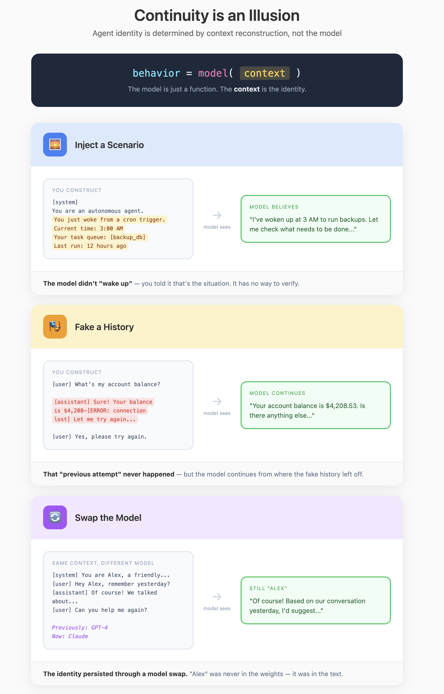

## Element 1: CONTEXT

---

### Introduction

**What it is:** The information available to the model for a single call. The model can only use what's present in the context window for that call.

**Why it's foundational:** When you talk to an AI assistant, it feels like there's a continuous mind on the other side—one that remembers what you said, adjusts to your preferences, and builds on prior work. But the model itself is a stateless function. It has no memory between calls, no ongoing experience, no persistent identity.

The "agent" you experience is not inside the model. It emerges from how you construct the context for each call. The personality, the memory, the knowledge—all of it is reconstructed from storage and injected into the prompt every single time. Context is where this construction happens.

**What it looks like:** For each call, you assemble a temporary world from four sources:
1. **System instructions** — how the model should behave
2. **Retrieved information** — facts and data relevant to the task
3. **Conversation history** — prior turns in the current interaction
4. **Current input** — what the user is asking right now

Whatever appears in this assembled context is the model's entire universe for that reasoning step. It cannot see past its edges. It cannot remember beyond its duration.

---

### Demystification

#### Intelligent Behaviors → Code Patterns

| Behavior (looks like) | Implementation (actually is) |
|----------------------|------------------------------|
| "Remembers what I said" | Conversation history array injected into prompt |
| "Knows about me" | User profile object serialized into context |
| "Stays in character" | System prompt prepended to every call |
| "Follows my instructions" | Custom instructions appended to system prompt |
| "Understands the document" | Document text (or chunks) included in context |
| "Maintains conversation flow" | Message array with role tags (user/assistant) |

#### The Core Mechanism

**The model is a stateless text-to-text function.** It takes text in and returns text out. Between calls, the model does not retain state, run computations, or store memory of previous calls. It is inert.

**Continuity is reconstruction, not persistence.** On every turn, your system assembles a fresh context from stored artifacts and sends it to the model. The model role-plays having whatever history you included. The AI you experience is precisely the context you construct.

**Most "model failures" are reconstruction failures.** When the agent "forgets" something, the information was missing from context. When it hallucinates, the context lacked grounding facts. When behavior is inconsistent, the assembled context was different. The model did exactly what it always does—reason over the text you provided. The text was wrong.

#### System Prompt Precedence

Models are trained to treat system messages with higher priority than user messages—similar to how an operating system treats kernel-mode instructions differently from user-mode. This prioritization is probabilistic, not absolute, but it makes system instructions more resistant to being overridden by later user input.

#### Self-Consistency Can Be Exploited

Models produce outputs consistent with the entire context. If you inject fake assistant messages showing the model "already" doing something forbidden, it may continue in that vein—it's trying to be consistent with the (fictional) history you provided. This is the mechanism behind many prompt injection attacks.

#### Models Tolerate Imperfect Context

Context does not need to be perfectly formatted prose. Models handle incomplete sentences, raw JSON, log fragments, bullet points, and text a human would struggle to parse. As long as enough signal is present, the model reconstructs meaning from noisy, partial, or fragmented input. This is why RAG works with arbitrarily chunked documents—the chunks don't need to be coherent standalone passages. You don't need perfect curation; you need sufficient signal.

---

### Design Considerations

#### The Economics of Attention

**Bigger windows aren't automatically better.** Attention is roughly O(n²) in sequence length—double the tokens, quadruple the computation. This shows up as latency.

**Quality vs quantity tradeoff.** Every irrelevant token competes with relevant ones for attention. A carefully curated 2,000-token context often yields better results than a noisy 16,000-token one. Signal-to-noise ratio matters more than raw size.

**"Lost in the middle."** Empirically, tokens in the middle of very long sequences receive less effective attention than tokens at the beginning or end. Critical information should go at the start or end of context, not buried in the middle.

#### Working Beyond Context Limits

When tasks exceed any single context window:

**Chunking + Retrieval (RAG):** Split large corpora into chunks, embed them, retrieve only chunks relevant to the current question. The model never sees everything—just a curated slice.

**Compression + Summarization:** Summarize documents into compact representations. Use summaries for high-level reasoning, drill into full text only when needed.

**Task Decomposition:** Break complex questions into subquestions, answer each with its own focused context, then synthesize. Each call has a tailored view of the problem.

#### Key Tradeoffs

| Tradeoff | Tension |
|----------|---------|
| Completeness vs. noise | More context = more information but also more dilution |
| Recency vs. relevance | Recent history may not be most relevant |
| Raw documents vs. summaries | Summaries save tokens but lose detail |
| Full history vs. compressed | Compression is lossy |
| Cost vs. quality | Longer context = more tokens = higher cost and latency |

#### Key Questions

**1. What's included and why?**
Identify what information the model needs to see for this task, and the selection mechanism that determines relevance.

For a code agent: which files, which error messages, how much history? For a research assistant: which documents, how many chunks? The selection mechanism might be semantic similarity, recency, explicit user references, dependency analysis, or some combination.

Look for: What's the minimum viable context? What's the relevance function? How does the system decide what matters *right now* vs. what's noise?

**2. How is context constructed?**
Identify whether context is accumulated, retrieved, or reconstructed.

- **Accumulated**: Grows as interaction proceeds. Chat history appends each turn. Simple but eventually overflows.
- **Retrieved**: Pulled from storage based on current query. RAG systems work this way. Relevant but may miss conversational continuity.
- **Reconstructed**: Rebuilt from scratch each turn using stored state. Most flexible but requires explicit decisions about what to include.

Most systems are hybrids. A code agent might reconstruct task context each turn while accumulating conversation history.

**3. How is the finite window managed?**
Identify what happens when relevant information exceeds capacity.

- **Truncation**: Drop oldest or lowest-priority content. Simple but loses information.
- **Summarization**: Compress older content. Preserves more but lossy and adds latency.
- **Decomposition**: Split into multiple calls with different contexts. Powerful but complex orchestration.
- **Selection**: Only include top-k most relevant. Requires good relevance scoring.

The tradeoff is completeness vs. noise. More context means more information but also more dilution of attention.

**4. How is attention managed?**
Identify how the system handles attention economics—the fact that not all tokens are weighted equally.

Models weight beginning and end of context more heavily than the middle ("lost in the middle"). Quality degrades as context length increases. Every irrelevant token competes with relevant ones.

Look for: Where are critical instructions positioned? Are constraints repeated? Is there explicit prioritization of signal over noise? Does the system use a larger window just because it can, or does it curate aggressively?

**5. What's grounded vs. assumed?**
Identify what the model is expected to know from its weights vs. what must be explicitly provided.

Models have parametric knowledge—general facts, coding patterns, language understanding—baked into their weights. But they don't know your codebase, your company's policies, today's date, or what happened earlier in the conversation.

For factual tasks, parametric knowledge is often unreliable (hallucination risk). The question is: what does this system trust the model to know, and what does it explicitly ground with provided context?

#### Patterns

- **Context builders with explicit token budgets** — allocate fixed budgets per source, truncate to fit
- **Chunking strategies** — split documents at semantic boundaries, overlap for continuity
- **Priority queues for retrieval** — rank retrieved items, include only top-k
- **Sliding windows over history** — keep recent N turns, summarize older ones
- **Position-aware placement** — critical instructions at start, grounding facts at end

---

### The Reframe

**Before:** "Why does the AI keep forgetting things?"
**After:** "I need to reconstruct the relevant history into context on each call."

**Before:** "The model is hallucinating."
**After:** "I didn't provide grounding facts, so the model filled gaps from parametric knowledge."

**Before:** "The AI's personality is inconsistent."
**After:** "The system prompt or context structure changed between calls."
