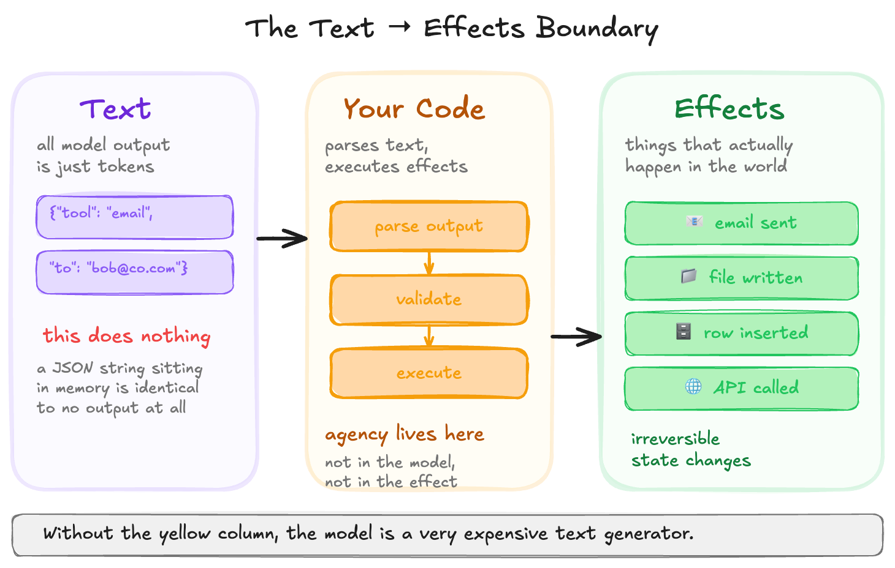
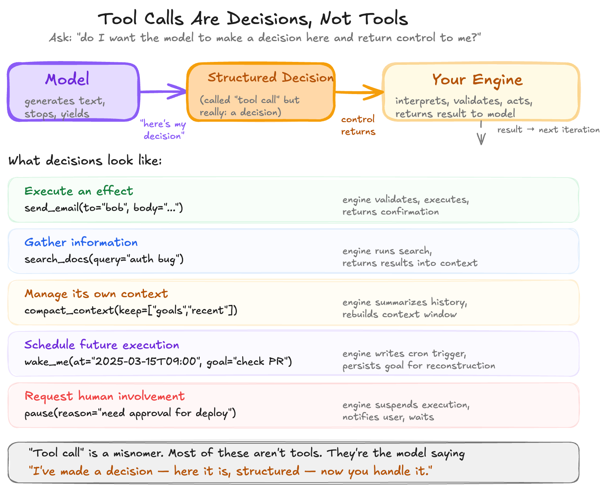
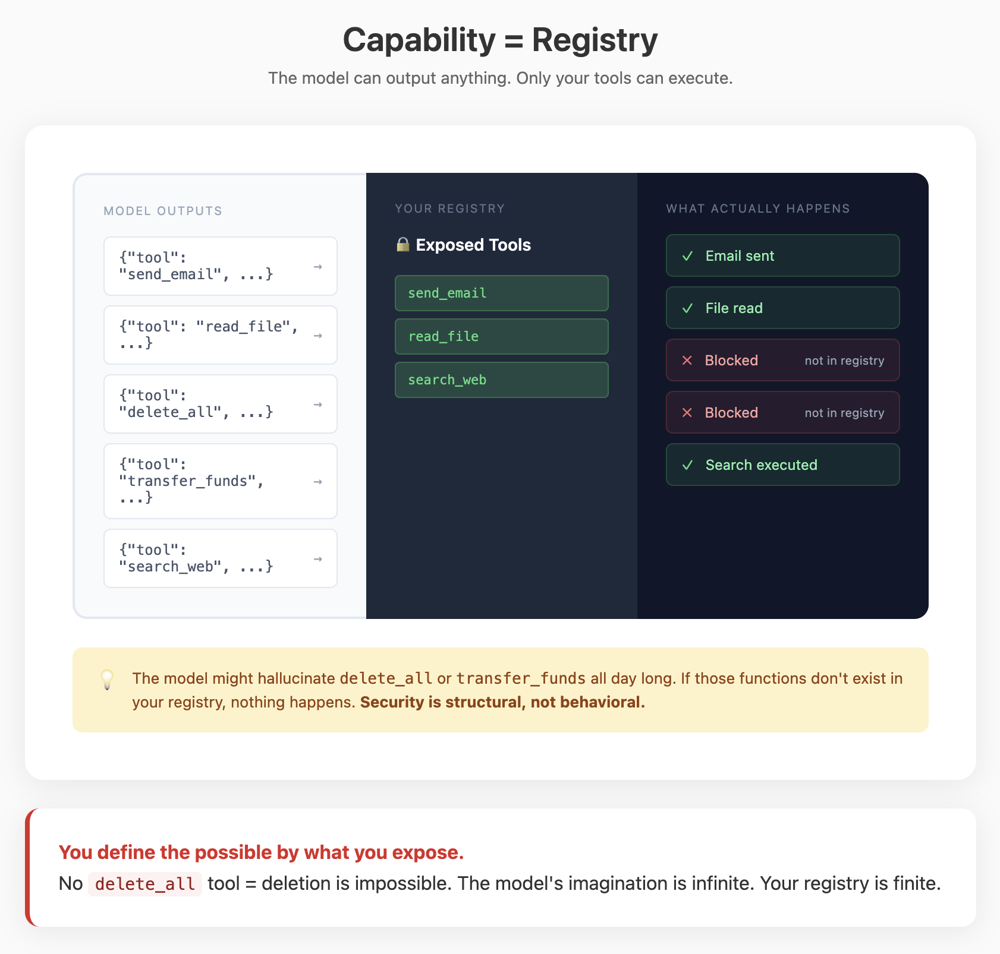
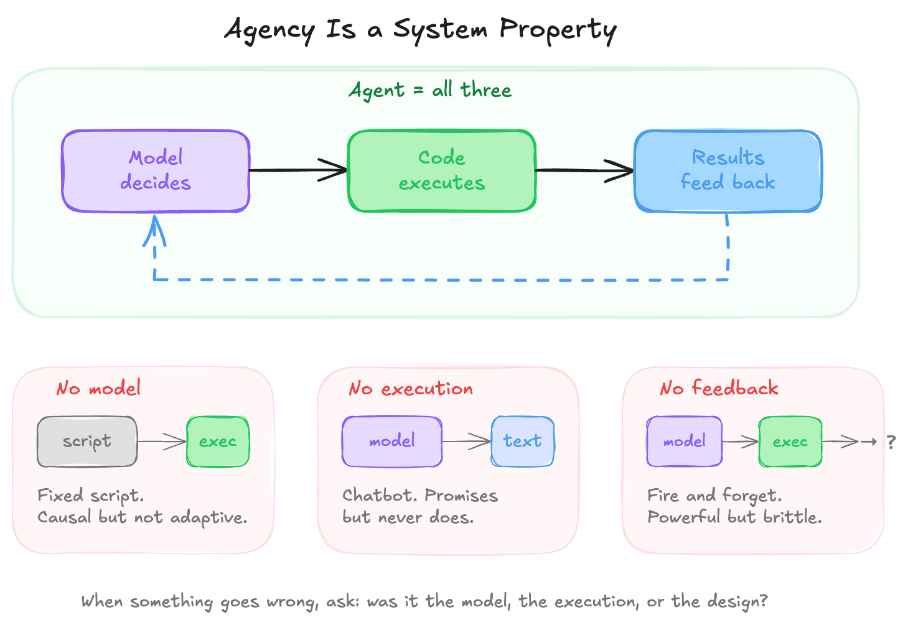
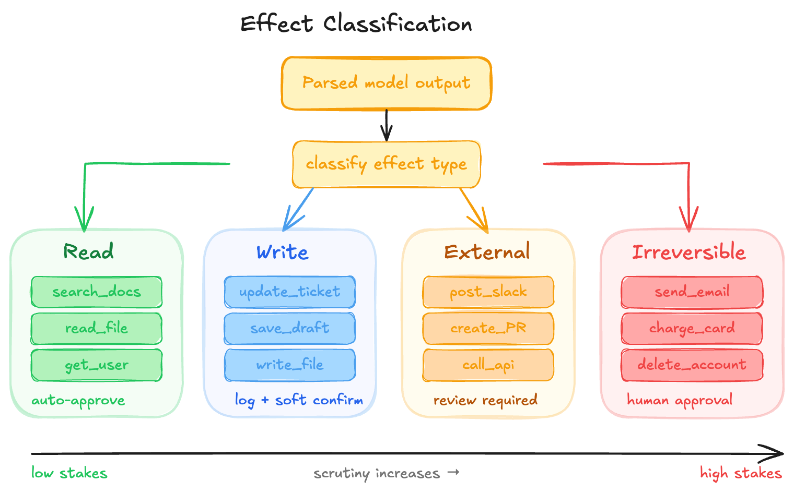

## Element 3: AGENCY

---

### Introduction

**What it is:** The translation layer from text to effects. The "interpreter" in code that takes output from the model and executes operations.

**Why it's foundational:** Text alone never causes effects. The model outputs text; your code decides whether to execute it. The email gets sent at the line that calls the SMTP API—remove that line and nothing happens, no matter what the model outputs.

The agent is not inside the model. It is the composite: model proposing, code executing, results feeding back.

**What it looks like:**
```
Model output (text) → Parser/Router → Policy check → Execution → Effects
```



---

### Demystification

#### Intelligent Behaviors → Code Patterns

| Behavior (looks like) | Implementation (actually is) |
|----------------------|------------------------------|
| "Can do things" | Structured output → parser → function dispatch |
| "Browses the web" | `browser_tool` handler + HTML parser |
| "Writes and runs code" | `code_execution` tool + sandboxed interpreter |
| "Sends emails/messages" | API integration wrapped as tool |
| "Makes decisions" | Classification output → switch/router |
| "Uses multiple tools together" | Code generation or defined tool chains |
| "Knows what it can do" | Tool schemas injected into system prompt |

#### The Core Mechanism

**The model has no agency.** Agency is causality—the ability to cause effects in the world. The model produces text (data); your code interprets that text and executes it. Text by itself is inert data; interpreting and running it turns data into effects.

**The most dangerous mistake in agent design is implicit execution.** If arbitrary action-like text can trigger real effects without explicit parsing and policy checks, you have removed the boundary between model output and system execution.

#### Tool Calling Is Structured Output with Routing



When you enable "tool calling" or "function calling," the model's output changes shape—from prose to structured JSON naming tools and passing arguments. Mechanistically, nothing about the model has changed. It still only emits text. The difference is that you treat some of that text as structured JSON that your code parses and routes to specific functions.

Tool calling standardizes three things:
1. **Format** — The model produces JSON with a known shape, not arbitrary prose to regex
2. **Vocabulary** — A closed set of tool names, each with clear description and schema
3. **Router** — One place where model intent translates into function calls

The tradeoffs: constrained tools give predictable surface area (model can't invent tools), validatable input (schema checks before execution), and simple security (no `deleteAllUsers` tool means no deletion). The cost is flexibility—behavior not expressible as a sequence of tool calls requires adding new tools or multiple round-trips.



#### Code Execution Is the Same Pattern

When a model writes code instead of selecting from tools, it appears qualitatively different. Mechanistically, nothing fundamental has changed. The model outputs text that happens to be code; your sandbox decides whether to run it, under what constraints, and with what capabilities exposed.

If code is never executed, it causes no effects. If it runs in a sandbox without network or filesystem access, it has less capability than a tool that can send email. Your infrastructure confers or withholds agency—the model just writes strings.

Within a constrained sandbox, a single call can express loops, conditionals, and data transformations without tool round-trips. But bugs become runtime errors, security mistakes in sandbox configuration can expose unintended capability, and observability is harder than with clean tool logs.

#### Agency Is a System Property



The agent is the entire loop: model deciding, code executing, results feeding back. Remove any piece and you get something different:

- **No model:** A fixed script that always calls the same tool. Causal but not adaptive.
- **No execution:** A chatbot that promises but never does. Conversational but not agentic.
- **No feedback:** A system that acts but never learns from results. Powerful but brittle.

When something goes wrong, you can ask three separate questions:
1. Did the **model** choose a bad action given its instructions and context?
2. Did the **execution layer** authorize something it should have blocked?
3. Did **you** define tools or policies that made the bad outcome possible?

This decomposition is how you debug and improve agent systems.

---

### Design Considerations

#### Key Tradeoffs

| Tradeoff | Tension |
|----------|---------|
| Tools vs. code | Tools constrain (safer, predictable); code expands (flexible, riskier) |
| Flexibility vs. safety | More capability = more potential for damage |
| Automation vs. oversight | Auto-execution is fast but risky; approvals are safe but slow |
| Expressiveness vs. observability | Code is expressive but hard to log; tools are limited but auditable |

#### Key Questions

**1. What actions are possible?**

Identify the action space—the set of operations the system can perform.

- **Finite tool set:** Named functions with schemas. Model can't invent new tools.
- **Code execution:** Arbitrary computation within sandbox constraints.
- **Hybrid:** Tools for side effects, code for pure computation.

The action space is defined by your tool registry and sandbox configuration. If there's no `deleteAllUsers` tool and the sandbox has no database access, deletion is impossible no matter what the model outputs.

Look for: What's in the tool registry? What does the sandbox expose? What's explicitly impossible?

**2. How is intent translated to effect?**

Identify the execution boundary—where text becomes action.

- **Parsing:** How is model output interpreted? JSON schema validation? Code compilation?
- **Routing:** How are parsed instructions dispatched to handlers?
- **Execution:** Where does the actual API call, database write, or file operation happen?

The execution boundary should be explicit and singular. One place where model intent becomes function calls. This is where you inject policy checks, logging, and approvals.

Look for: Where exactly does text become effect? Is that boundary explicit or scattered?

**3. How are effects classified?**

Identify the effect categories and how scrutiny maps to stakes.



- **Read:** Fetches data, no state change. Usually auto-approved.
- **Write:** Modifies internal state. Logged, may require soft confirmation.
- **External:** Affects systems outside your control. Requires careful review.
- **Irreversible:** Cannot be undone (emails sent, payments made). Requires explicit approval or is blocked.

Look for: How are tools categorized? Does policy enforcement match the category? Are irreversible actions gated appropriately?

**4. Where is policy enforced?**

Identify the control points—where decisions about whether to execute are made.

- **Schema validation:** Reject malformed requests before execution
- **Policy checks:** Role-based access, rate limiting, environment restrictions
- **Approval gates:** Human confirmation for high-stakes actions
- **Simulation mode:** Execute against mock systems in staging

Policy should be centralized—one enforcement function between model intent and execution, not scattered checks across handlers.

Look for: Is there a single policy enforcement point? What gates exist for high-stakes actions? How does staging differ from production?

**5. What's logged at the boundary?**

Identify the observability surface—what records exist for debugging and audit.

Once systems cause effects, mistakes persist. Emails can't be unsent. Files can't be undeleted. You need records: what the model proposed, what policy decided, what actually happened.

A minimal action log captures: user request, proposed action (tool + arguments), authorization decision, execution status, and effects produced.

Look for: Is there a structured action log? Can you reconstruct what happened from logs? Can you identify whether failures were model decisions, policy failures, or tool bugs?

#### Patterns

- **Tool registries with effect metadata:** Each tool declares read/write/external/irreversible
- **Centralized policy enforcement:** One function between intent and execution
- **Schema validation before dispatch:** Reject malformed requests early
- **Approval workflows for irreversible actions:** Human gates for high stakes
- **Sandboxed code execution:** Constrained runtime for model-generated code
- **Structured action logs:** What was proposed, authorized, executed, effected
- **Different agent shapes against same tools:** Single-action, background, interactive differ in orchestration

---

### The Reframe

**Before:** "How do I make the AI do things?"
**After:** "How do I design the execution boundary between text and effects?"

**Before:** "The AI sent the wrong email."
**After:** "The model proposed an action, and my execution layer ran it. Which component failed—model decision, policy check, or tool definition?"

**Before:** "The agent has too much power."
**After:** "The tool registry and sandbox configuration define what's possible. I control the capability set."
