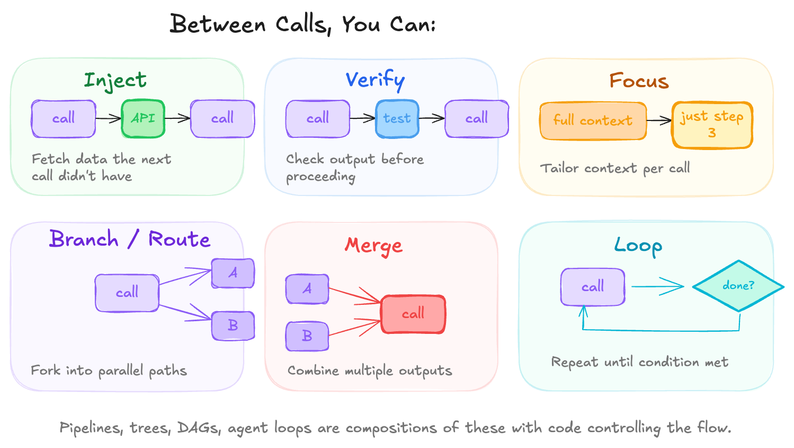

## Element 4: REASONING

---

### Introduction

**What it is:** The grammar of call composition. How you chain, loop, branch, and merge LLM calls to build behavior that exceeds what any single call can do.

**Why it's foundational:** A single LLM call is bounded. It cannot pause mid-generation to fetch new data. It cannot execute code and observe results. It cannot genuinely reconsider after committing to tokens. Everything it produces is conditioned only on what was present at call start.

Reasoning appears when you compose multiple calls with computation between them. The behavior you observe in capable agents does not happen inside any single call—it emerges from the structure of calls, the artifacts passed between them, and the code that decides what happens next.

**What it looks like:** Multiple calls connected by your code:
```
Call → Result → [computation] → Call → Result → [computation] → ...
```

The computation between calls is where you inject information, verify outputs, branch into alternatives, and decide whether to continue or stop.

The **agent** is the canonical structure that emerges: a loop where the model decides the next action, your code executes it, and the result feeds back into context for the next iteration. The agent is not a special kind of model—it is a reasoning structure built from composition.

---

### Demystification

#### Intelligent Behaviors → Code Patterns

| Behavior (looks like) | Implementation (actually is) |
|----------------------|------------------------------|
| "Thinks step by step" | Multiple LLM calls with state passed between |
| "Plans before acting" | `plan = llm.call(...)` then `for step in plan: execute(step)` |
| "Checks its own work" | Generate call → separate verify call → conditional retry |
| "Recovers from errors" | Try/catch around execution → error fed back to next LLM call |
| "Keeps working until done" | While loop with termination condition check |
| "Breaks down complex tasks" | Recursive decomposition: task → subtasks → sub-subtasks |

#### The Core Mechanism

**Reasoning is the structure of how calls relate.** A single call generates text. Reasoning emerges from composing multiple calls with computation between them.

**A single call is bounded.** It produces one text output conditioned on what was known at call start. It cannot fetch new data mid-generation. It cannot execute tools and observe results. It cannot store to memory or retrieve from it. A single call has no agency and no memory—just text in, text out.

**Between calls, you can do work the model cannot.** This is what composition unlocks:

- **Inject information:** Fetch data, run tools, call APIs. The next call sees results that didn't exist before.
- **Verify:** Check outputs before proceeding—run tests, validate schemas, check constraints.
- **Focus:** Tailor context per call. A planning call sees only the task. An execution call sees only its step.
- **Branch:** Fork into parallel paths, explore alternatives.
- **Merge:** Combine outputs from multiple calls into one.
- **Loop:** Repeat until a condition is met.



These six operations are the primitives. The structures that emerge—pipelines, trees, DAGs, agent loops—are compositions of these primitives with code controlling the flow.

---

### Design Considerations

#### The Grammar of Composition

**Sequence** — Output of one call feeds the next:
```
Call A → Result A → Call B (using Result A) → Result B
```

**Branch** — Fork into parallel paths:
```
Call A → Result A
           ├→ Call B1 (path 1)
           └→ Call B2 (path 2)
```

**Merge** — Combine outputs from multiple calls:
```
Result B1 ─┐
           ├→ Call C (combining both)
Result B2 ─┘
```

**Loop** — Repeat until condition met:
```
while not done:
    result = call(context)
    context.append(result)
    done = check_termination(result)
```

#### The Agent Loop

The canonical form that combines all of the above:

```python
context = [task]
while True:
    action = model.decide_next_step(context)
    if action.type == "done":
        return action.result
    result = execute(action)
    context.append(action)
    context.append(result)
```

The model decides what to do next. Your code executes it. The result feeds back into context. The loop continues until the model signals completion or a limit is reached.

**Continuity across calls comes from your code.** The model does not remember previous calls—it reads its own history as text that your code accumulated. The apparent train of thought is real, but it lives in your orchestration, not inside the model.

#### Key Questions

**1. What's the composition structure?**

Identify the shape of how calls relate.

- **Pipeline:** Fixed sequence (plan → execute → verify). Code controls flow.
- **Tree:** Branch into alternatives, select best. Explores the output distribution.
- **Loop:** Repeat until done. The agent pattern.

Most agents are loops. Pipelines are for known processes. Trees are for exploration.

**2. What happens between calls?**

Identify the interstitial computation.

- **Tool execution:** Run the action the model requested
- **Information injection:** Fetch data, call APIs, observe results
- **Context update:** Append results, summarize history, prepare next input
- **Routing:** Decide which call to make next

**3. Who decides the next action—model or code?**

Identify where control flow lives.

- **Model-directed:** The model chooses what to do next from available tools. Flexible but unpredictable.
- **Code-directed:** Your code determines the sequence; model provides intelligence at each step. Predictable but rigid.
- **Hybrid:** Code controls phases; model has autonomy within each phase.

If you're fighting the prompt to enforce a specific process, the process probably belongs in code.

**4. How is history accumulated?**

Identify what the model sees of its own past.

Each iteration, the model reads the accumulated history as text. It has no memory—it sees what your code provides. You control what persists, what gets summarized, what gets dropped.

Accumulated context degrades quality over time. Strategies: sliding windows, periodic summarization, selective inclusion.

**5. What are the termination conditions?**

Identify how the loop knows when to stop.

- **Explicit signal:** Model outputs "done" or equivalent
- **Max iterations:** Hard limit prevents infinite loops
- **External condition:** Task completed, user interrupted, timeout

Infinite loops are a real failure mode. Define explicit exit conditions.

#### Key Tradeoffs

| Tradeoff | Tension |
|----------|---------|
| Single call vs. multiple | More calls = more capability but more latency and cost |
| Model-directed vs. code-directed | Model flexibility vs. predictable structure |
| Accumulated vs. reconstructed context | Continuity vs. relevance decay |

#### Patterns

- **Plan → Execute → Verify pipelines**
- **Separate generator and evaluator calls**
- **Iterative refinement loops** (generate → critique → revise)
- **Recursive decomposition** (task → subtasks → sub-subtasks)
- **Checkpointing** for long-running sequences

---

### The Reframe

**Before:** "How do I make it think step by step?"
**After:** "I externalize the steps into separate calls with computation between them."

**Before:** "The agent seems to have a continuous train of thought."
**After:** "My code accumulates history and injects it into each call. The model reads its own past as text."

**Before:** "Why can't it just figure out what it needs and go get it?"
**After:** "A single call can't fetch new information mid-generation. I need to split into multiple calls with retrieval between them."
