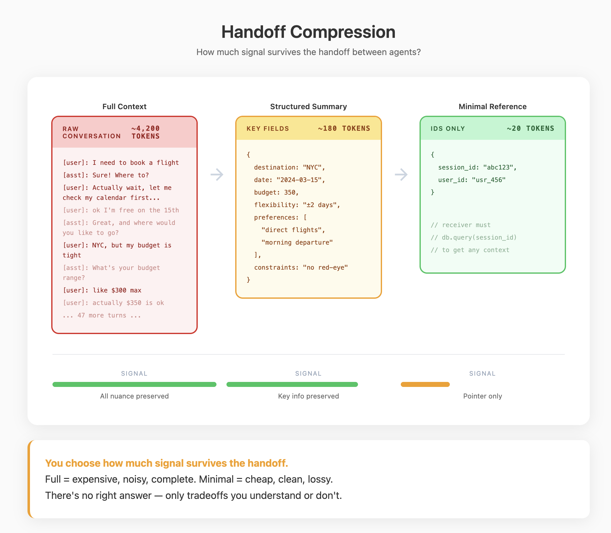

## Element 5: COORDINATION

---

### Introduction

**What it is:** Communication and sequencing between reasoning structures. Two questions: **what runs when** (execution flow) and **what information passes** (data flow).

**Why it's foundational:** Once you have multiple reasoning structures—pipelines, loops, agents—you need to define how they connect. Execution flow determines sequencing—what triggers what, what runs in parallel. Data flow determines communication—what context transfers, what state is shared.

**What it looks like:** Reasoning structures connected by execution flow and data flow:
```
         ┌─────────────────────────────────────┐
         │           EXECUTION FLOW            │
         │  (what triggers what, sequencing)   │
         └─────────────────────────────────────┘
                          │
Input → Router → Agent A → Agent B → Output
                          │
         ┌─────────────────────────────────────┐
         │             DATA FLOW               │
         │  (what information transfers)       │
         └─────────────────────────────────────┘
```

Execution flow: Router decides Agent A runs first, then Agent B. Data flow: A's output is compressed into a handoff structure that B receives.



---

### Demystification

#### Intelligent Behaviors → Code Patterns

| Behavior (looks like) | Implementation (actually is) |
|----------------------|------------------------------|
| "Has multiple experts" | Different system prompts routed by classifier |
| "Knows who to ask" | Intent classification → dispatch to handler |
| "Delegates to specialist" | Handoff function that transfers context subset |
| "Team of agents working together" | Parallel calls + result aggregation |
| "Agents debate/discuss" | Turn-taking loop between different prompts |
| "Asks human for help" | Async wait + human input channel + resume |
| "Pipeline of specialists" | Sequential calls with typed handoffs |

#### The Core Mechanism

**Coordination has two dimensions: execution flow and data flow.**

- **Execution flow:** What triggers what. Who decides the next step. What runs in parallel vs. sequential. This is the control structure.
- **Data flow:** How information passes between reasoning structures. What context transfers on handoff. What shared state exists. This is the information structure.

**Execution flow patterns:**
- **Sequential:** Agent A finishes, then Agent B starts
- **Parallel:** Multiple agents run simultaneously, results merged
- **Conditional:** Router decides which agent runs
- **Nested:** One agent spawns sub-agents for subtasks

**Data flow patterns:**
- **Handoff:** A's output becomes B's input (compressed, structured)
- **Shared artifact:** Multiple structures read/write common state
- **Message passing:** Structures exchange discrete messages
- **Blackboard:** Central store that any structure can update

**Multi-agent = multi-context.** Each "agent" is reconstructed on every call from its system prompt and current context. What looks like agents conversing is: call with prompt A → append output → call with prompt B → append output. The value is specialization, not independent entities.

#### Why Split Into Multiple Reasoning Structures?

**Context economy.** Each structure gets a focused context: specialized prompt, curated tool set, smaller slice of history. One mega-context with everything leads to interference. Splitting buys you focus.

**Parallelization.** Like the actor model in distributed systems, independent structures can work simultaneously on different subtasks. Research five competitors in parallel, then synthesize. Total latency is the longest single task, not the sum.

---

### Design Considerations

#### Coordination Patterns

**Routing** — Classify and dispatch:
```
Input → Classifier → Dispatch to appropriate agent
```

**Pipeline** — Sequential processing with typed handoffs:
```
Agent A → Handoff → Agent B → Handoff → Agent C
```

**Parallel + Merge** — Fork, work concurrently, combine:
```
        ┌→ Agent B1 ─┐
Input ──┼→ Agent B2 ─┼→ Merge → Output
        └→ Agent B3 ─┘
```

**Shared Artifact** — Structures read/write common state:
```
Agent A ─┐           ┌─ Agent A
Agent B ─┼→ Artifact ←┼─ Agent B
Agent C ─┘           └─ Agent C
```

**Human-in-the-loop** — Human as async participant:
```
Agent → Request → [Human reviews] → Response → Agent continues
```

#### Key Questions

**1. What are the distinct reasoning structures?**

Identify the agents, pipelines, and loops that make up the system.

Each reasoning structure from Element 4 (pipelines, trees, loops, agent loops) becomes a unit that can be coordinated. An "agent" is a loop where the model decides actions; a "pipeline" is a fixed sequence. Each has its own context configuration—system prompt, tool set, history accumulation strategy.

Look for: What are the distinct units? What context configuration does each have? What makes each one specialized?

**2. What is the execution topology?**

Identify how reasoning structures sequence and trigger each other.

- **Pipeline:** Fixed sequence, Agent A → Agent B → Agent C
- **Parallel fork-join:** Multiple structures run concurrently, results merged
- **Conditional routing:** Classifier dispatches to one of several structures
- **Nested:** One agent spawns sub-agents for subtasks
- **Hybrid:** Combination of patterns

Look for: What triggers what? What runs concurrently vs. sequentially? Who decides the next step—code or model?

**3. How does routing work?**

Identify how work gets directed to the right reasoning structure.

- **LLM-based:** Model classifies input into categories
- **Rule-based:** Keywords, patterns, or explicit user choice
- **Hybrid:** Rules for clear cases, LLM for ambiguous ones

Look for: What's the classifier? How are routing errors detected? What happens on misrouting?

**4. What is the data flow?**

Identify what information passes between reasoning structures.

**Handoffs** (sequential transfer):
- **Full context:** Everything the previous structure accumulated. Complete but noisy.
- **Structured summary:** Compressed into typed object. High signal but lossy.
- **Selected fields:** Specific data the next structure needs. Minimal but brittle.

**Shared state** (concurrent access):
- **Shared artifact:** Document or data structure multiple structures read/write
- **Blackboard:** Central store any structure can update

Look for: What does each reasoning structure receive? What do multiple structures access concurrently?

**5. How do parallel paths merge?**

Identify how concurrent reasoning structures synchronize.

- **Barrier:** Wait for all parallel structures to complete, then merge results
- **First wins:** Take the first acceptable result, cancel others
- **Streaming:** Process results as they arrive

Look for: What triggers the merge? How are conflicts or inconsistencies resolved? What happens if one path fails?

**6. Where do humans participate?**

Identify where human judgment enters the coordination flow.

- **Approval gates:** Human must approve before high-stakes actions execute
- **Escalation:** Structure hands off to human when confidence is low
- **Review loops:** Human reviews output before it's passed to next structure
- **Async input:** System pauses, waits for human response, then resumes

Look for: What decisions require human approval? How is async human input handled? What's the fallback if human doesn't respond?

**7. What determines the boundaries between reasoning structures?**

Identify why the system is split into multiple structures rather than one.

Look for evidence of what drove the decomposition:
- **Context specialization:** Different structures need different prompts or tools
- **Parallelization opportunity:** Independent subtasks that can run concurrently
- **Phase separation:** Stages that need isolated context (planning vs. execution)
- **Failure isolation:** Containing blast radius of errors

If two structures have nearly identical configurations, the split may add unnecessary coordination overhead.

#### Key Tradeoffs

| Tradeoff | Tension |
|----------|---------|
| Specialization vs. coordination cost | Focused contexts vs. handoff complexity |
| Parallel vs. sequential | Speed vs. simplicity |
| Full context vs. compressed handoff | Completeness vs. noise |
| LLM routing vs. rule-based | Flexibility vs. reliability |

#### Patterns

- **Router classifiers** (LLM or rule-based)
- **Typed handoff structures** with explicit fields
- **Shared artifacts** that multiple structures read/write
- **Approval queues** for human-in-the-loop
- **Supervisor agents** that monitor and redirect

---

### The Reframe

**Before:** "How do I make agents talk to each other?"
**After:** "How do I move the right information between focused contexts?"

**Before:** "I need a team of AI agents."
**After:** "I need multiple specialized prompts with routing and handoffs."

**Before:** "The agents are collaborating."
**After:** "Different system prompts are being applied to a shared context in sequence."
