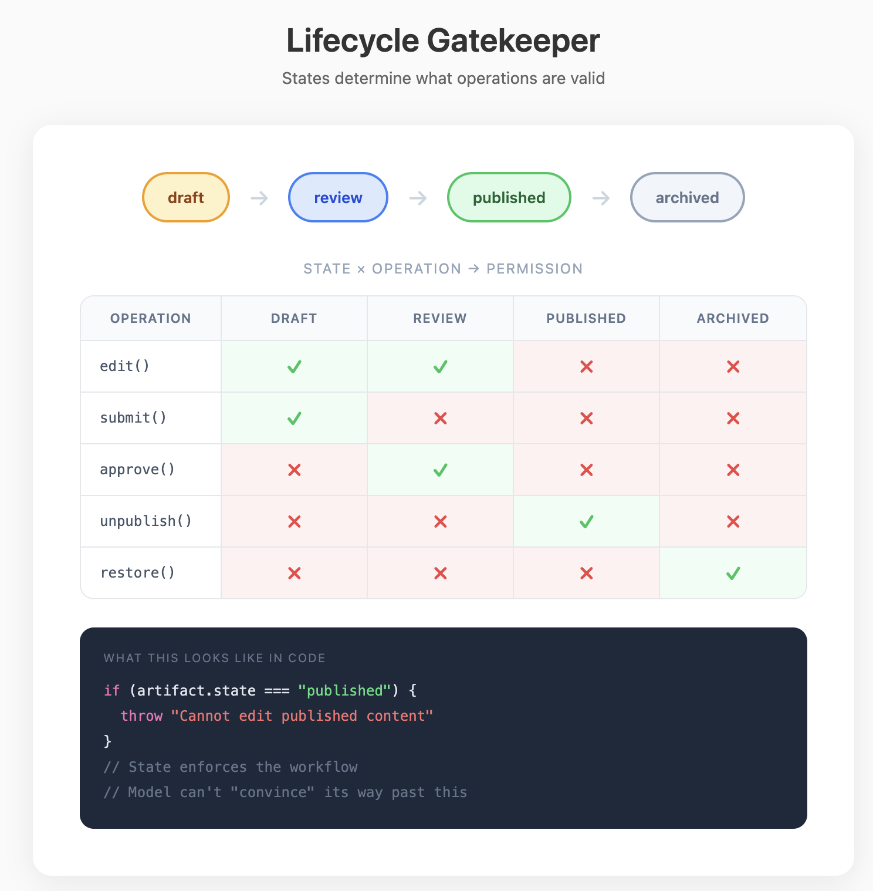

## Element 6: ARTIFACTS

---

### Introduction

**What it is:** The persistent objects that work produces and that future work operates on. Artifacts are **shared persistent state for coordination** — where Element 2 (Memory) is storage for a single agent's context, artifacts are shared storage that multiple reasoning structures read and write.

**Why it's foundational:** Individual agent calls are short-lived, and message history is discarded when the next prompt is built. But task boards, draft documents, and code repositories persist across sessions and accumulate changes. Work produces artifacts, and artifacts become the coordination surface for future work.

Without artifacts, multi-agent systems try to carry all state in messages and context windows, but the work product has no persistent location. With artifacts, progress is stored in objects that outlive any single agent call.

**What it looks like:** Shared objects with structure, operations, and lifecycle:
```
Agent A ─┐                    ┌─ Agent A
Agent B ─┼→ Artifact (state) ←┼─ Agent B
Agent C ─┘    ↓               └─ Agent C
         Operations: addSection(), claimTask(), approve()
         Lifecycle: draft → review → approved → published
```

Agents don't message each other directly — they read the artifact's current state, perform operations, and write updates. The artifact is the coordination surface.

---

### Demystification

#### Intelligent Behaviors → Code Patterns

| Behavior (looks like) | Implementation (actually is) |
|----------------------|------------------------------|
| "Maintains a document collaboratively" | Shared object with `addSection()`, `editSection()` operations |
| "Tracks progress on tasks" | State machine: `todo → in_progress → done` |
| "Multiple agents work on same thing" | Shared data structure with defined operations |
| "Follows a workflow" | Artifact lifecycle states + valid transitions |
| "Agents coordinate without messaging" | Blackboard pattern: agents poll/update shared artifact |
| "Edits code files" | File system as artifact + text operations |
| "Manages a codebase" | Git repository as artifact + commit/branch operations |

#### The Core Mechanism

**Artifacts store work state persistently.** Instead of progress living in message history or agent memory, it lives in persistent objects. If an agent crashes mid-task, the artifact still contains everything completed so far.

**Structure constrains valid states.** A task board with columns and statuses makes certain states impossible by design. You can't have a task "in progress" without an assignee if the schema requires it. The artifact's schema implements coordination logic.

**Operations encode domain semantics.** Instead of agents manipulating raw data, they invoke meaningful operations: `claimTask()`, `addSection()`, `approve()`. Each operation maintains invariants. You can't approve a section that hasn't been reviewed if the operation enforces it.

**Lifecycle gates valid transitions.** Artifacts move through states: draft → review → final. The lifecycle determines which operations are valid at each stage. You can't edit a published document. You can't merge an unapproved PR.



#### The Core Distinction: Files vs. Typed Objects

Artifacts can be implemented using two common approaches:

**Files (Unix Ecosystem)**

What you get:
- Entire ecosystem built around them: editors, grep, sed, diff, git
- Universal — every tool can read/write files
- Composition via pipelines (`cat file | grep x | sort`)
- Human-readable and debuggable
- Most existing agents assume files

What you give up:
- Untyped — a file is just bytes, meaning lives in conventions
- Operations are generic (`read`, `write`) — no domain semantics
- Validation is external — file doesn't know if its contents are valid
- Concurrency is hard — locking, merge conflicts

**Typed Objects (Semantic Operations)**

What you get:
- Operations encode domain semantics — `claimTask()`, not `update()`
- Schema validation — artifact enforces its own invariants
- Lifecycle states — artifact knows where it is in workflow
- Concurrency handled — operations are atomic, conflicts prevented by design

What you give up:
- Custom tooling required — can't just use vim/grep
- Less universal — each artifact type needs its own interface
- More upfront design — must define schema and operations
- No ecosystem leverage

**Choose based on what the system requires:**
- Code manipulation → files (ecosystem is essential)
- Workflow coordination → typed objects (semantics matter)
- Queryable state → database (SQL is powerful)
- Version history → git (built-in branching/merging)

---

### Design Considerations

#### Artifact Anatomy

**Structure** — What fields and relations exist
- Typed fields with defined schemas
- Relations to other artifacts
- Nested components where appropriate

**Operations** — What you can do with it
- Domain-specific verbs, not generic CRUD
- Each operation maintains invariants
- Operations can have preconditions

**Lifecycle** — What states it moves through
- States: draft, in_review, approved, published, archived
- Valid transitions: draft → in_review (not draft → published)
- State determines which operations are valid

**Storage** — Where it lives
- Database tables, files, virtual file system
- Determines querying, versioning, access patterns

#### Key Questions

**1. What artifacts exist?**

Identify the persistent objects that agents create and operate on.

Look for: What are the main entities of the system? Documents, tasks, research findings, code files, plans? Each artifact type has its own structure and purpose.

**2. What operations are possible?**

Identify the meaningful actions that can be performed on each artifact.

- **Generic operations:** read, write, delete — low semantic content
- **Domain operations:** `addSection()`, `claimTask()`, `approve()`, `merge()` — encode workflow meaning

Look for: Are operations just CRUD, or do they encode domain semantics? Do operations enforce invariants?

**3. What is the lifecycle?**

Identify the states artifacts move through and what gates transitions.

- **Linear:** draft → review → final
- **Branching:** can return to earlier states (review → draft for revisions)
- **Parallel:** different parts of artifact in different states

Look for: What states exist? What triggers transitions? What operations are valid in each state?

**4. Where are artifacts stored?**

Identify the storage substrate and what it enables.

- **File system:** Unix ecosystem access, git integration, human-readable
- **Database:** Queries, transactions, relationships, consistency
- **Virtual objects:** Custom storage, typed operations, managed lifecycle
- **Hybrid:** Files for code, database for metadata, objects for workflow state

Look for: What storage does the system use? What does that enable or prevent?

**5. How do agents interact with artifacts?**

Identify the access patterns — how agents read, modify, and coordinate through artifacts.

- **Direct manipulation:** Agents edit artifact state directly
- **Operation-based:** Agents invoke defined operations that maintain invariants
- **Event-driven:** Agents react to artifact state changes

Look for: Do agents go through operations or manipulate raw state? How are conflicts prevented?

#### Key Tradeoffs

| Tradeoff | Tension |
|----------|---------|
| Files vs. typed objects | Ecosystem access vs. semantic operations |
| Generic vs. domain operations | Flexibility vs. safety |
| Simple vs. complex lifecycle | Ease of use vs. workflow enforcement |
| Explicit vs. implicit coordination | Message passing vs. shared artifact state |

#### Patterns

- **Artifact schemas** with validation (JSON Schema, TypeScript interfaces)
- **Operation handlers** that enforce invariants
- **State machines** for lifecycle management
- **Blackboard pattern** — agents poll/update shared artifact instead of messaging
- **Event sourcing** for history and audit trails

---

### The Reframe

**Before:** "Agents keep breaking the document format."
**After:** "I'll define operations instead of letting agents edit raw text."

**Before:** "How do agents coordinate on a shared task?"
**After:** "The artifact is the coordination surface — agents read and write it, not each other."

**Before:** "Where does the work live between agent calls?"
**After:** "In artifacts — persistent objects that outlive any single agent."
