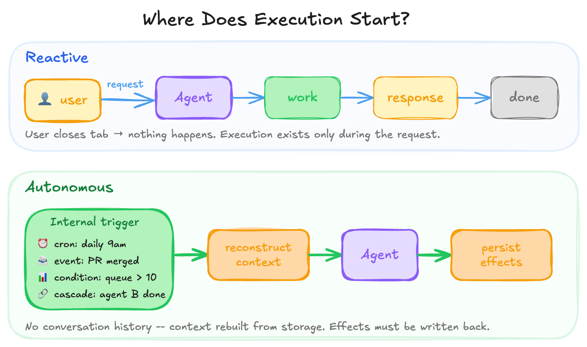
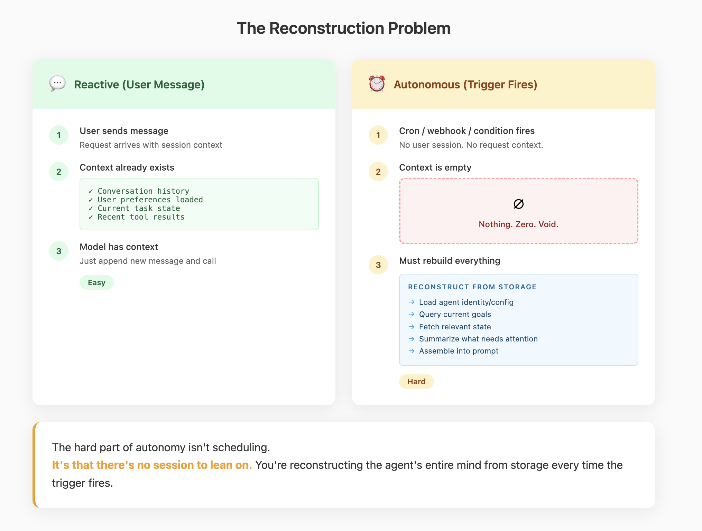
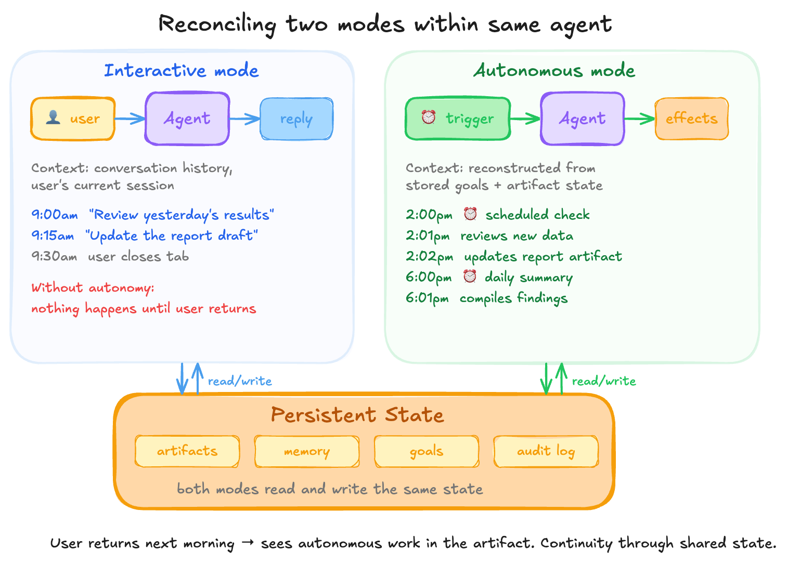
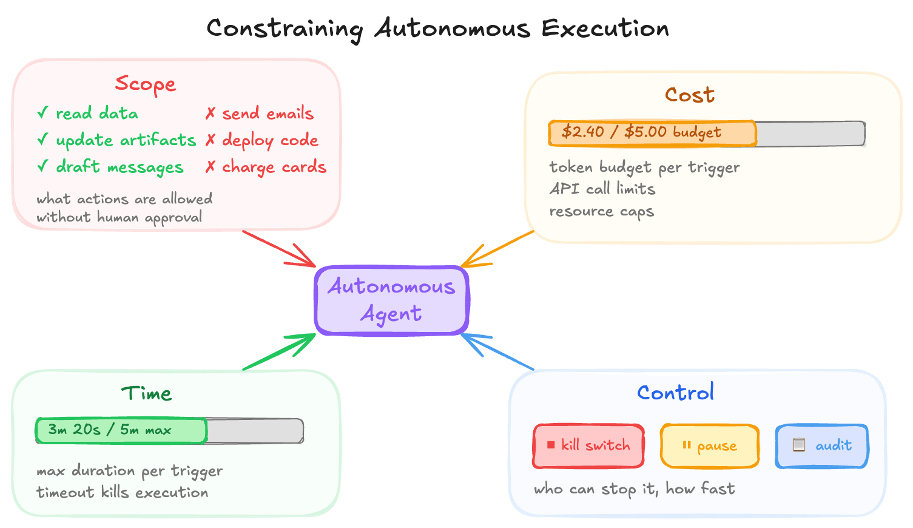

## Element 7: AUTONOMY

---

### Introduction

**What it is:** What triggers execution. Autonomy is about **who owns the main loop** — whether the system runs only when called by users/external services, or whether it can initiate work on its own through internal triggers.

**Why it's foundational:** Most software is reactive: a request arrives, the system executes code, and a response goes back. Agentic systems break this pattern. They keep working after the user closes the tab, notice new information and react, make progress on goals overnight. This shift from reactive to autonomous affects how you design, operate, and reason about the system.

Autonomy is a property of your architecture: a cron job that runs an LLM prompt with tool calls is autonomous, while a button that calls an LLM is reactive. What matters is where control flow begins.



**What it looks like:** Internal triggers that start execution without external calls:
```
Reactive:    User Request → Agent → Response
Autonomous:  [Schedule/Event/Condition] → Reconstruct Context → Agent → Persist Effects
```

When an autonomous trigger fires, there's no conversation history — the agent's context must be reconstructed from stored state, and whatever happens must feed back into persistent state for continuity.



---

### Demystification

#### Intelligent Behaviors → Code Patterns

| Behavior (looks like) | Implementation (actually is) |
|----------------------|------------------------------|
| "Works while I sleep" | Cron job / scheduled task triggers agent |
| "Always available" | Long-running process with message listener |
| "Proactively checks in" | Heartbeat timer + condition check + optional action |
| "Notices when things change" | File watcher / webhook endpoint / event subscription |
| "Has its own agenda" | Stored goals + context reconstruction at trigger time |
| "Responds to events" | Event queue consumer + handler dispatch |
| "Manages its own schedule" | Scheduler service that queues future triggers |
| "Remembers what it was doing" | State persisted to storage, reconstructed into prompt |

#### The Core Mechanism

**Autonomy is about trigger source, not intelligence.** A system is autonomous when some execution paths originate internally — from schedules, stored goals, or event subscriptions — rather than from external requests. The model inside doesn't change this classification.

**Context must be reconstructed at trigger time.** When an autonomous trigger fires, there's no user session, no conversation history. The agent's personality, goals, and relevant state must be loaded from storage and assembled into a prompt. This is the same reconstruction principle from Element 1 (Context), applied to autonomous execution.

**Autonomous actions must feed back into persistent state.** Whatever happens during autonomous execution needs to persist — artifacts updated, memory written, goals marked complete. When the user returns, they should see the effects. Continuity between autonomous and interactive modes requires explicit state management.

**Most triggers fall into a few types:**
- **Schedule:** Fixed intervals or calendar times (cron, every 5 minutes, daily at 9am)
- **Event:** External system calls endpoint, message arrives, file changes
- **Condition:** Internal state crosses threshold (queue depth > 10, goal becomes achievable)
- **Cascade:** One agent triggers another, scheduler manages multiple agents

---

### Design Considerations

#### Key Questions

**1. What triggers execution?**

Identify whether the system is reactive, autonomous, or hybrid.

- **Purely reactive:** All entry points are external (HTTP, RPC, user actions)
- **Purely autonomous:** All entry points are internal (schedules, events, conditions)
- **Hybrid:** Some paths reactive, some autonomous

Look for: where control flow originates and what can start work without a human.

**2. What are the trigger types?**

Enumerate the specific autonomous triggers in the system.

- **Schedules:** Cron jobs, interval timers, calendar-based
- **Events:** Webhooks, message queues, file watchers
- **Conditions:** State thresholds, goal completion checks
- **Cascades:** Agent-to-agent triggers, orchestrators

Look for: which internal triggers exist and which external events the system subscribes to.

**3. What determines timing and frequency?**

Identify when and how often autonomous triggers fire.

- Fixed schedule (every N minutes, daily at specific time)
- Event-driven (fires when specific events occur)
- Condition-based (fires when state crosses threshold)
- Dynamic (system adjusts its own timing based on load or goals)

Look for: the cadence, whether timing can be configured, and what controls frequency.

**4. How is context reconstructed at trigger time?**

Identify how the agent's state, personality, and goals are rebuilt without conversation history.

- **Stored goals:** Objectives loaded from database into prompt
- **State inspection:** Current system state summarized into context
- **Custom prompt:** Purpose-built prompt for autonomous execution (different from interactive)
- **Entity reconstruction:** Agent personality/identity rebuilt from persistent configuration

Look for: what gets loaded into the prompt and how the agent determines what it should be doing.

**5. How do autonomous actions feed back?**

Identify how autonomous activity relates to persistent state and user-facing sessions.

- **State persistence:** What gets written back (artifacts, memory, goal status)?
- **Session continuity:** Does activity appear in user's conversation thread when they return?
- **Notification:** Is user informed of autonomous actions?
- **Audit trail:** Is there a record of what happened while user was away?

Look for: how continuity is maintained and what the user sees when they return.



**6. What boundaries constrain autonomous execution?**

Identify limits on what the system can do without human involvement.



- **Scope:** What actions are allowed autonomously vs. require human approval
- **Cost:** Token budgets, API call limits, resource caps
- **Time:** Maximum execution duration per trigger
- **Control:** Kill switches, pause mechanisms, who has authority to stop it

Look for: which actions are disallowed autonomously and how the system can be stopped.

#### Key Tradeoffs

| Tradeoff | Tension |
|----------|---------|
| Reactive vs. autonomous | User control vs. system initiative |
| Frequent vs. infrequent triggers | Responsiveness vs. resource cost |
| Rich vs. minimal context reconstruction | Capability vs. latency/cost |
| Tight vs. loose boundaries | Safety vs. flexibility |

#### Patterns

- **Trigger → Reconstruct → Execute → Persist:** The standard autonomous execution pattern
- **Heartbeat with condition check:** Periodic wake-up, only act if condition met
- **Event-driven with backpressure:** Subscribe to events, but rate-limit processing
- **Goal persistence:** Store objectives that survive across triggers
- **Hybrid modes:** Reactive for user requests, autonomous for background work

---

### The Reframe

**Before:** "How do I make the agent proactive?"
**After:** "What trigger fires, and how is context reconstructed when it does?"

**Before:** "The agent decides when to act."
**After:** "My scheduler/event system decides when to run; the agent decides what to do."

**Before:** "The agent remembers what it was working on."
**After:** "I persist goals to storage and reconstruct them into the prompt at trigger time."
