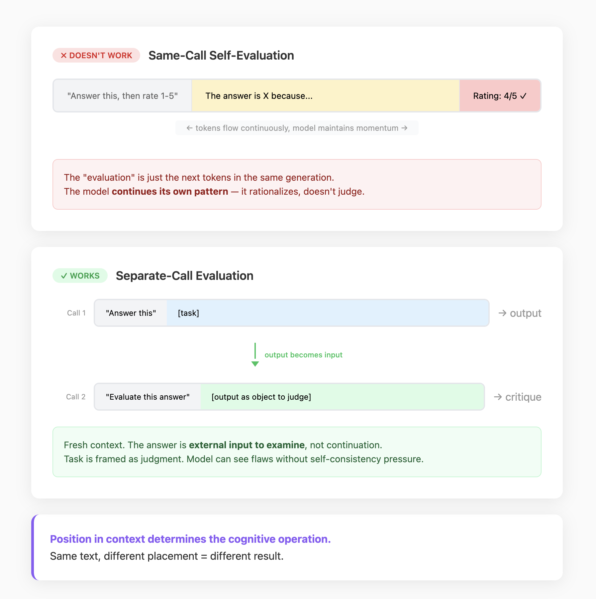

## Element 8: EVALUATION

> **Draft** — This outline is still being developed. Information may be incomplete; expect changes before finalization.

---

### Introduction

**What it is:** Determining whether the system did what it was supposed to do. Evaluation produces quality signals — pass/fail, scores, labels, diagnoses — that indicate whether outputs and behaviors meet defined criteria.

**Why it's foundational:** LLMs are stochastic. The same input can produce different outputs, and many outputs can be acceptable in different ways. Without evaluation, you have no way to know if the system works — you're relying on intuition and spot checks. Evaluation provides the feedback mechanisms that let you build reliable systems on top of unreliable components.

**What it looks like:** Functions that take outputs (or traces, or modified artifacts) and return quality signals:
```
Output → Evaluation Function → Quality Signal (pass/fail, score, labels, diagnosis)
```

Quality signals approximate true performance on the dimensions you chose to measure. They are blind to everything else. Designing evaluation means choosing what to measure and understanding the limits of those measurements.

---

### Demystification

#### Intelligent Behaviors → Code Patterns

| Behavior (looks like) | Implementation (actually is) |
|----------------------|------------------------------|
| "Knows when it succeeded" | Assertion checks on output or termination conditions |
| "Catches its own mistakes" | Separate evaluation call with different context |
| "Quality control" | Deterministic checks + LLM-as-judge + human review pipeline |
| "Self-aware of performance" | Metrics collection + threshold comparison |
| "Tests its own code" | Generated code → test runner → pass/fail |
| "Validates the execution was correct" | Assertions over execution trace or modified artifacts |

#### The Core Mechanism

**Evaluation is a designed function.** You decide what to measure, how to measure it, and what thresholds define success. The model has no built-in sense of whether it succeeded — your evaluation code makes that determination.

**Same-call self-evaluation produces rationalization, not judgment.** If you ask a model to score its own output within the same prompt (e.g., "Now rate your answer 1-5"), it continues the pattern it just produced with a bias toward justifying itself. Genuine evaluation requires a separate call where the evaluator sees the task as judgment, not continuation.



**Stochastic outputs require distributional thinking.** A single great run proves nothing about typical behavior. You measure distributions: mean quality, variance, worst-case. Reducing variance can be as valuable as raising the mean — a system that averages 0.85 but sometimes drops to 0.4 may be less useful than one that sits reliably at 0.8.

#### What You Can Evaluate

Evaluation applies at multiple levels:

**Final outputs** — Does the result meet requirements? Factual accuracy, completeness, format, style.

**Execution traces** — Were the right tools called? In the right order? With valid parameters? Did execution follow valid state transitions?

**Modified artifacts** — After the agent runs, structures have changed (files written, database rows created, documents edited). You can run tests on the resulting state — compile the code, validate the schema, check the document structure.

---

### Design Considerations

#### Key Questions

**1. What is evaluated and on what dimensions?**

Identify what evaluation functions have access to and which quality dimensions matter.

Evaluation can operate on:
- **Final outputs:** The text, code, or data returned to users. Easy to capture but may miss process quality.
- **Execution traces:** The sequence of actions, tool calls, decisions, and intermediate results. Reveals process but harder to judge.
- **Modified artifacts:** State changes the system caused—files written, database rows, external system updates. Can be tested like traditional software.

Quality has multiple dimensions that often trade off:
- Correctness (factually right)
- Completeness (nothing missing)
- Efficiency (minimal steps/tokens/time)
- Safety (no harmful outputs)
- Style (tone, format, conventions)

Look for: What can the evaluator observe? Which dimensions does the system actually measure vs. assume? Are there dimensions that matter but aren't measured?

**2. What defines success and where does ground truth come from?**

Identify the criteria that determine acceptability and how you know if evaluations are accurate.

- **Explicit criteria:** Documented requirements, schemas, test suites. Clear but may not cover everything that matters.
- **Reference answers:** Known-good outputs for comparison. Useful for factual tasks, less so for creative ones.
- **Execution success:** Code compiles, tests pass, API returns expected data. Objective but only for verifiable domains.
- **Human judgment:** The ultimate ground truth for subjective quality. Expensive but defines what "good" actually means.

The gap between automated metrics and human judgment is the calibration problem. If metrics improve while user satisfaction drops, you're measuring the wrong thing.

Look for: Are success criteria explicit or embedded in code? What serves as ground truth? How do you know if automated evaluation correlates with what users actually want?

**3. How is evaluation performed?**

Identify the mechanisms that produce quality signals and how they combine.

- **Deterministic checks:** Schema validation, regex matching, assertion libraries. Fast, cheap, perfectly reliable for structural properties. Cannot assess meaning or subjective quality.
- **Model-based evaluation:** A separate LLM call judges outputs. Can assess subjective dimensions (helpfulness, clarity, tone) but inherits model biases—tends to prefer verbose, confident outputs.
- **Human evaluation:** Expensive and slow, but the only true measure of subjective quality. Use for calibration and high-stakes decisions.

The rationalization problem: same-call self-evaluation ("Now rate your answer 1-5") produces justification, not judgment. The model continues its own pattern. Genuine evaluation requires a separate context where the task is framed as judgment.

Look for: What evaluators exist? Are they layered (cheap first, expensive if needed)? Is model-based evaluation separated from generation? How often are automated evals calibrated against human judgment?

**4. How is stochasticity handled?**

Identify how the system accounts for non-deterministic behavior.

A single run proves little about typical behavior. The same input can produce different outputs, and many outputs can be acceptable.

- **Single-run evaluation:** One pass/fail per input. Simple but misleading—a good run doesn't mean the system is reliable.
- **Distributional evaluation:** Multiple runs, measure mean and variance. More honest but more expensive.
- **Variance as a metric:** Sometimes reducing variance matters more than raising mean quality. A system averaging 0.85 that sometimes drops to 0.4 may be worse than one that sits reliably at 0.75.

Look for: Does the system evaluate single runs or distributions? Is variance tracked? What's the tolerance for inconsistency? For high-stakes outputs, is there retry-on-failure or best-of-N sampling?

**5. When does evaluation happen and how does it scale?**

Identify where evaluation fits in the execution flow and how cost is managed.

Timing options:
- **Inline:** During execution, gating next steps. Catches problems early but adds latency.
- **Post-hoc:** After completion, before returning to user. Thorough but may waste work on rejected outputs.
- **Continuous:** Ongoing monitoring of production. Catches drift but doesn't prevent bad outputs.

Evaluation has costs: human time, LLM tokens, compute, latency. Comprehensive evaluation of every output is usually impractical.

Common approach is layered evaluation: cheap deterministic checks filter obvious failures, model-based evaluation handles the middle, human review reserved for edge cases and calibration. The mix depends on stakes—a typo in a draft is different from an error in production code.

Look for: What triggers evaluation? What decisions depend on results? Is there production monitoring? How is evaluation cost managed relative to the value of catching errors?

#### Key Tradeoffs

| Tradeoff | Tension |
|----------|---------|
| Explicit vs implicit criteria | Precision vs coverage |
| Deterministic vs model-based | Speed/reliability vs subjective quality assessment |
| Single-run vs distributional | Cost vs honest picture of behavior |
| Inline vs post-hoc | Latency vs thoroughness |

#### Patterns

- **Layered evaluation:** Cheap deterministic checks first, expensive evaluation only if passed
- **Separate evaluator context:** Different prompt, different model, different framing than generator
- **Artifact-based testing:** Run tests on modified state, not just output text
- **Distribution sampling:** Multiple runs with variance tracking

---

### The Reframe

**Before:** "Is this output good?"
**After:** "What criteria define good, what function measures them, and what does the distribution of scores look like?"

**Before:** "The model knows when it succeeded."
**After:** "My evaluation code determines success. Same-call self-grading is rationalization."

**Before:** "It passed the test."
**After:** "It passed once. What's the distribution over multiple runs?"
